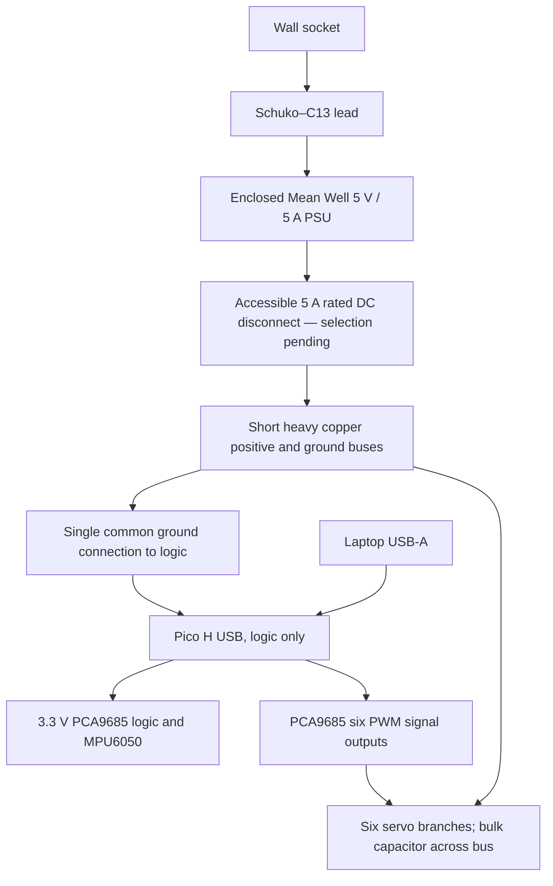

# School Biped S6 — hardware-first implementation handoff

Research checked 8 October 2026. Generated by `tools/build_handoff.py`; source files embedded below are the actual project files. **Status: runnable, locally tested simulation; provisional hardware design; procurement and manufacturing remain blocked.** Sourced claims, estimates, software results and unmeasured hardware are distinguished throughout.

## 1. Short design recommendation

Use six Waveshare 15024 MG90S servos in a small biped with **hip pitch, knee pitch and ankle roll on each leg**. Short 50 mm thighs/shins, broad 90 × 45 mm feet, laptop inference, Pico H, PCA9685 and an MPU6050 form a reasonable research baseline for slow stepping. Estimated assembled mass is **208.4 g**, with approximately **189 mm frame height** in the home pose. No arms or decorative head are required.

This is a prototype proposal, not a verified walking kit. The known delivered basket is **€90.32**, leaving **€9.68 for every unresolved item**. Finished prints, matched horns, fasteners and a suitably rated power connector are still unquoted/unconfirmed. The €100 constraint has **not** been met by a complete purchasable basket. Do not order the full robot or manufacture these interfaces yet. No component purchases or supplier messages were made.

The software can immediately run test training. Its provisional twin uses the proposed frame and exact selected product dimensions, plus explicitly estimated interfaces and dynamics. It is not a frozen twin of an assembled robot. A 10,240-step smoke run produced standing and approximately 1–2 mm of drift, **not walking**. The six-servo [Lynxmotion BRAT](https://wiki.lynxmotion.com/info/wiki/lynxmotion/view/ses-v1/ses-v1-robots/ses-v1-bipeds/brat/) is a mechanical precedent; it does not prove small-servo RL transfer.

## 2. Comparison of 6 DOF versus 8 DOF

| Design | Walking / stability | Cost, mass and power | RL / transfer / mechanics | Decision |
|---|---|---|---|---|
| A: each leg hip roll, hip pitch, knee pitch; 6 total | Lateral leg control, but both ankle axes fixed; foot orientation and landing constrained | Six servos €21, 73.2 g before frame; six unknown current loads | Few actions; fixed feet may require large lean and edge contact; easy frame, falls load hip gears | Compare only |
| B: A + ankle pitch; 8 total | Better sagittal foot alignment; no ankle roll; larger motion range | Servos €28, 97.6 g; **at least** €7 and 24.4 g extra plus brackets/wires/printing; assumed simultaneous peaks rise 4.8 → 6.4 A | More actions, failure points and calibration; extra freedom does not automatically help RL; proposed 5 A supply no longer covers the peak hypothesis | Upgrade requiring a new budget/power/frame design |
| Selected: hip pitch, knee pitch, ankle roll; 6 total | Direct lateral weight shift at the feet; broad soles help; coupled sagittal foot pitch limits step length | Six servos; same motor cost as A; short links reduce bending moments | Six controls and replaceable brackets; repeatable slow lean/lift/land sequence is plausible; no hip yaw or ankle pitch limits turning and uneven-ground performance | Baseline |

Eight joints cannot fit the present basket without further cost reductions: extra motors alone take the known subtotal to €97.32, before additional frame/power and the existing unknowns. Choose few joints to reduce calibration, wear and budget pressure. Neither configuration supplies true servo feedback or certified continuous torque. Stable walking remains an experiment.

## 3. Selected robot architecture

Joint order is **left hip, left knee, left ankle, right hip, right knee, right ankle**, everywhere. SI coordinates are **x forward, y left, z up**. Hips and knees rotate about local **+y**; ankle roll about **+x**. At zero angles, body axes match the parent. Positive pitch tips a downward link toward −x; positive ankle roll rotates the foot plane according to the right-hand rule. Physical right-hand servo mounting requires measured pulse signs; do not assume both legs share an electrical sign.

The torso contains the two hip servo housings, controller, PWM board and IMU. Each thigh carries its knee housing. Each shin carries no servo housing; each foot carries its ankle housing. This matches the proposed printed brackets and avoids double-counting actuator mass. Electronics are tied to the backplate with protected/insulated wiring; IMU mounting must be rigid. A short heavy power bus feeds servo branches separately from the logic.

The policy runs at **50 Hz** on the laptop. Pico processes the IMU at **200 Hz**, updates PCA pulse targets at 50 Hz and reports **post-limit command targets**, never measured shaft positions. MuJoCo runs at 500 Hz. A 200 Hz IMU on the 2 ms simulation grid alternates 4/6 ms intervals; the estimator uses the actual interval.

Actions are six normalized values in `[-1,1]`, mapped linearly to the JSON safe intervals. Home angles are `[-10,10,0,-10,10,0]°`; neutral action is therefore **not six zeros**. Each observation frame is estimated gravity direction (3), gyro divided by 10 rad/s (3), normalized applied command targets (6), previous requested actions (6). Five frames make **90 float32 observations**. The same complementary gravity filter uses raw accelerometer/gyro in simulation and the robot. Sensor axes/bias are calibrated before filtering; accelerometer blending is suppressed for large deviations from gravity. Translation, true attitude, true joint angles, velocity and contact are excluded from policy inputs. Five frames give roughly 80 ms of history; they cannot recover every unobserved servo error.

## 4. Servo comparison

These are product-specific claims, not interchangeable specifications for all similarly named servos. Prices include VAT; stock and variants must be checked at checkout. 1 kgf·cm = 0.09807 N·m.

| Exact product / source | Unit price / availability | Size; mass | Voltage; claimed stall torque | Claimed unloaded speed | Gear/control / assessment |
|---|---|---|---|---|---|
| [Waveshare 15286 SG90](https://www.welectron.com/Waveshare-15286-SG90-Servo_1) | €1.90; listing indicated about three months delivery | 22.8 × 12.2 × 28.5 mm; 10.5 g | 4.8–6 V; 2.0/2.2 kgf·cm | 0.09/0.08 s per 60° at 4.8/6 V | Plastic gears, position PWM; lower cost but gearbox/fall durability concerns; €9.60 saving for six does not establish the whole budget |
| **[Waveshare 15024 MG90S](https://www.welectron.com/Waveshare-15024-MG90S-Servo_1)** | **€3.50; shown in stock** | **22.8 × 12.2 × 28.5 mm; 12.2 g** | **4.8–6 V; 2.0/2.8 kgf·cm** | **0.11/0.09 s per 60° at 4.8/6 V** | Metal gears, position PWM; chosen for low price and replaceability, with selected-product dimensions |
| [MG90D at Rotorama](https://www.rotorama.de/product/mg90d) | €4.09; stock shown | 22.8 × 12.4 × 28.5 mm; 12 g | 4.8–6 V; 1.8/2.2 kgf·cm | Table says 0.10 and 0.08 s, both labelled 4.8 V; higher-voltage speed **unresolved** | Metal, digital position PWM; claimed 90° between 1000–2000 µs, horns included; not enough evidence of better repeatability to justify selecting it |
| [FEETECH FS90, Pololu data](https://www.pololu.com/product/2818/specs), [EU seller](https://eckstein-shop.de/feetech-fs90-1-5kg-analog-servo) | EU listing €3.55; availability/country messages ambiguous | 23.2 × 12.5 × 22 mm; 9 g | 4.8–6 V; 1.3/1.5 kgf·cm | 0.12/0.10 s per 60° | Plastic, analog PWM; 120° at 900–2100 µs, documented 3.3 V signals; weaker and different frame; **FS90R is continuous rotation and unsuitable** |

Selected listing also claims 180° travel and 5 µs deadband. Neither proves calibrated angular range, backlash or long-term repeatability. [Original TowerPro MG90S](https://towerpro.com.tw/product/mg90s-3/) has different mass/torque claims; those are not specifications for the Waveshare item. Very cheap servos can vary with load, voltage, temperature and wear. Metal gears do not guarantee low backlash. Expect per-servo calibration and replacements.

For all four, sustainable torque, lifetime and gear backlash are **unknown**. Current for the selected MG90S, SG90 and listed MG90D is **unknown**. Pololu measured approximately 600 mA stall and 200 mA no-load at 6 V for FS90, explicitly variable; its [manufacturer PDF](https://www.pololu.com/file/0J1435/FS90-specs.pdf) gives different current numbers. Do not transfer either current value to MG90S. No real torque/current measurements were performed.

Torque feasibility: `τ = m g d`. A 250 g mass at 20 mm offset requires `0.250 × 9.81 × 0.020 = 0.0491 N·m`; a rough 2× dynamic margin gives 0.0981 N·m. The selected seller's 4.8 V stall claim is 0.196 N·m. Stall torque is not a safe repeated-hold rating. The simulation starts with **0.08 N·m intermittent estimated force cap**; physical PWM servos have no programmable torque cap.

The actual 208.4 g proposed body distribution was evaluated by virtual work, holding the left foot fixed and allowing the right foot to be unloaded. Moments below are absolute magnitudes; this is a gravity calculation, not a loaded-servo test:

| Pose | Left hip | Left knee | Left ankle | 2× worst demand | Interpretation |
|---|---:|---:|---:|---:|---|
| Home, pretend single left support | 0.0013 | 0.0139 | 0.0695 N·m | 0.1390 N·m | COM is 34 mm to the side, outside 22.5 mm foot half-width; **not a feasible balanced single-support pose** |
| 15° lateral lean toward left | 0.0013 | 0.0134 | 0.0356 N·m | 0.0712 N·m | COM lateral offset 17.4 mm is inside the ideal support footprint; little measured margin yet |
| Lift right leg after leaning | 0.0039 | 0.0161 | 0.0337 N·m | 0.0675 N·m | Right knee gravity demand 0.0126 N·m; plausible slow-step starting pose |
| Deep stance bend, stress case | 0.0112 | 0.0494 | 0.0423 N·m | 0.0989 N·m | Exceeds provisional 0.08 N·m at 2× margin; do not treat every angle-limit pose as a safe loaded stance |

See [reproducible torque calculations](validation/torque_estimates.json) and `tools/torque_estimates.py`. Transfer weight before lifting; keep initial movements slow. Shock loads from falls are not covered by this static calculation.

## 5. Complete BOM with sourced prices and links

This is the complete **required-item register**, with unresolved costs explicitly retained. It is **not a complete purchasable basket**. Prices are checked listings, not saved checkout invoices. VAT and standard Germany shipping are included where priced. A free school helper is assumed for soldering/lead preparation; a paid charge must enter the budget. Laptop, measurement tools and ordinary screwdrivers are outside robot-part cost. No printer or battery is assumed.

| Category | Exact item / supplier source | Qty | Unit € | Line € | Selection / unresolved issue |
|---|---|---:|---:|---:|---|
| Motors | [Waveshare 15024 MG90S](https://www.welectron.com/Waveshare-15024-MG90S-Servo_1) — Welectron | 6 | 3.50 | 21.00 | VAT included, stock shown; horn/screw inclusion unverified |
| Electronics | [Raspberry Pi Pico H](https://www.berrybase.de/raspberry-pi-pico-rp2040-mikrocontroller-board-mit-headern) — BerryBase | 1 | 5.50 | 5.50 | Pre-soldered headers; USB Micro B |
| Electronics | [BerryBase 157066 PCA9685 board](https://www.berrybase.de/berrybase-16-kanal-pwm-servo-treiber-board-pca9685-i2c-12bit-1-6khz-3-3-5v) — BerryBase | 1 | 6.50 | 6.50 | One in stock; loose connectors in package. Use only signals/logic: power rail rating unknown |
| Sensors | [Funduino F23107397 MPU6050 module](https://funduinoshop.com/elektronische-module/sensoren/bewegungs-und-distanzsensoren/mpu-6050-modul-triaxial-beschleunigungssensor-gyroskop) — Funduino | 1 | 2.90 | 2.90 | Header soldering/board orientation to confirm |
| Power | [Mean Well GST40A05-P1J 5 V 5 A desktop PSU](https://www.berrybase.de/meanwell-schaltnetzteil-5v-dc-5-0a-mit-hohlstecker-5-5x2-1mm) — BerryBase | 1 | 14.90 | 14.90 | C14 inlet; centre-positive 5.5 x 2.1 mm; no mains lead in package |
| Power | [Goobay 68604 Schuko to C13, 1.5 m](https://www.berrybase.de/kaltgeraete-netzkabel-schutzkontakt-stecker-abgewinkelt-iec320-c13-buchse-schwarz) — BerryBase | 1 | 3.81 | 3.81 | Exact 1.5 m variant; 10 A AC rating |
| Wiring/connectors | [Official Raspberry Pi RPI-MUSB-1 USB data cable 1 m](https://www.berrybase.de/offizielles-raspberry-pi-micro-usb-kabel-rot-1-0m) — BerryBase | 1 | 1.80 | 1.80 | USB-A PC assumed; USB-C-only PC requires extra adapter, currently not priced |
| Wiring/connectors | [DUPK-40-FF-20, 40 female-female Dupont leads, 20 cm](https://www.berrybase.de/40pin-jumper-dupont-kabel-female-female-trennbar/laenge-0-20-m) — BerryBase | 1 | 1.80 | 1.80 | Logic/IMU only, AWG28; never main servo power |
| Wiring/connectors | [Funduino F23108007 JR-Futaba extension, 10 cm](https://funduinoshop.com/elektronische-module/elektromotoren-und-zubehoer/elektromotoren/servomotoren/jr-futaba-servo-verlaengerung-kabel-10cm-female/male) — Funduino | 6 | 1.42 | 8.52 | Helper prepares power-injection harness; branch current rating/gauge unverified |
| Wiring/connectors | [Donau E-175-16 violet copper wire 0.75 mm², 10 m roll](https://www.berrybase.de/donau-kupferschaltlitze-0-75-mm2-10m-lang-1-adrig-24x0-20mm-pvc-isoliert) — BerryBase | 1 | 5.50 | 5.50 | Only short power buses, <=10 cm each way; label positive/negative with shrink sleeve. Not a long tether |
| Power | [AiSHi ELK1M16VAWH 1000 µF 16 V capacitor](https://www.berrybase.de/elektrolytkondensator-1000-f-16v-1050c-1-radial-tht) — BerryBase | 1 | 0.29 | 0.29 | Polarity matters; actual tolerance ±20%, inconsistent page title ignored |
| Electronics | [MSW10K.25 10 kOhm axial resistor](https://www.berrybase.de/bauelemente/passive-bauelemente/widerstaende/) — BerryBase | 1 | 0.05 | 0.05 | OE pull-up; SKU price verified on category; exact detail URL not resolved |
| Wiring/connectors | [PINH-1X40P 40-pin 2.54 mm header](https://www.berrybase.de/stiftleiste-1x-40-polig-rm-2-54-gerade) — BerryBase | 1 | 0.60 | 0.60 | Helper cuts/solders signal and sensor headers as needed; Pico headers already fitted |
| Wiring/connectors | [McPower T1535561 heat-shrink, 100 pieces](https://www.berrybase.de/schrumpfschlauch-set-100-teilig-schwarz) — BerryBase | 1 | 1.90 | 1.90 | Insulate helper-soldered harness; mark polarity; helper supplies solder as workshop consumable |
| Fasteners | [McPower T1535501 cable ties, 100 x 2.5 mm, pack of 100](https://www.berrybase.de/kabelbinder-uv-bestaendig-nylon-100-stueck/farbe-transparent/masse-100x2-5mm) — BerryBase | 1 | 0.45 | 0.45 | 8 board mounts, 4 cable strain relief, 8 harness restraints; keep away from pinch points |
| Mechanical | [7 ready-finished PETG frames + 2 bonded TPU soles, VAT and German shipping](https://meltlab.de/preise) — Print service, quote pending | 1 | **pending** | **pending** | Exact STL upload quote unavailable; no printer/browser surface available. Not a price allowance |
| Mechanical | [6 matching horns + 6 servo shaft retaining screws](https://www.welectron.com/Waveshare-15024-MG90S-Servo_1) — Selected servo supplier; package confirmation pending | 1 | **pending** | **pending** | Required. Do not assume included; exact spline/horn pattern/shaft screw thread unknown |
| Fasteners | 12 M2 x 8 mm ear screws, 12 M2 nuts, 24 M2 washers; 12 horn-to-frame screws/washers matched to supplied horns — Print-service assembly kit quote pending | 1 | **pending** | **pending** | Dimensions/lengths provisional; supplier must include a matching kit and factory-clear holes. No drilling/tapping by assembler |
| Power | 5 A rated DC female 5.5 x 2.1 mm input pigtail/coupler and accessible disconnect, strain relief — Not selected: current-rated connector still unresolved | 1 | **pending** | **pending** | Goobay 76743 €0.50 not accepted as 5 A rated; rating unknown. Required input connection cannot be omitted |
| Shipping | [Welectron German DPD shipping](https://www.welectron.com/Shipping-cost) — Welectron | 1 | 4.95 | 4.95 | Basket under €49 free-shipping threshold |
| Shipping | [BerryBase German DHL shipping](https://www.berrybase.de/versand-und-zahlungsbedingungen) — BerryBase | 1 | 4.95 | 4.95 | Basket under €150 free-shipping threshold |
| Shipping | [Funduino German shipping](https://funduinoshop.com/versand-und-zahlungsbedingungen) — Funduino | 1 | 4.90 | 4.90 | One combined sensor/extensions order; separate first-servo order would add another shipping charge |

Selection rationale and alternatives: Pico H avoids header soldering and unnecessary Wi-Fi; a bare Pico might save board cost but adds soldering and needs a fresh price check. PCA9685 gives a common 50 Hz pulse source; Pico has enough PWM channels to replace it, but that changes this baseline and the firmware. MPU6050 is an inexpensive useful attitude/gyro source; no camera, lidar, encoder or foot switch is required. An IMU is strongly recommended because a command-only controller cannot detect body tipping. The enclosed Mean Well PSU avoids exposed mains wiring; a generic cheaper adapter is not accepted without a credible voltage/current rating and compliance documentation. Pre-soldered IMU/PWM alternatives could reduce helper work, but their delivered prices have not been established. Wires, resistor, header, capacitor, ties and shrink sleeve provide the required harness/OE/mounting functions; borrowing spare workshop parts changes actual cost only when confirmed.

The selected PCA board package lists loose connectors, so helper assembly is included as work, not assumed already soldered. Servo branches use six extensions prepared by the helper for power injection; branch gauge/current capability must be checked. No rail rating is assumed for PCA traces. Horn/screw inclusion is **not verified** and remains a required pending item.

Optional items: one spare MG90S costs €3.50 before any extra delivery; a slack safety line, thin protective mat and longer USB/heavier power tether remain unpriced optional additions. A USB-C-only laptop requires an adapter, which would become required. The baseline PSU lead/USB cable are approximately 1 m: initial short steps are possible near the supply, but a few-metre travel setup needs a separately priced tether. No complex overhead rig is mandatory.

## 6. Total cost and budget gate

| Budget element | Cost |
|---|---:|
| Known required products | **€75.52** |
| Welectron + BerryBase + Funduino standard shipping | **€14.80** |
| Known delivered subtotal | **€90.32** |
| Finished printing/soles, matched horn hardware, fasteners, rated DC connection | **Unknown** |
| Complete delivered total | **Not established** |
| Remaining under €100 for every unknown | **€9.68** |

The €50–75 target is not achieved by this basket: known products alone exceed €75, before shipping and all pending items. There is **no verified cheapest viable delivered configuration** under €100. The recommended configuration above is conditional on a passing quote and fit gate. An explicitly revised direct-Pico-PWM design could remove the €6.50 PCA board, bringing this known subtotal to €83.82 if all other costs stayed equal; printing/hardware remain unknown, so this is not a purchasable alternative or a silent substitution. Weaker servos have not been selected to disguise a shortfall.

If pending delivered costs sum to `U`, complete cost is `90.32 + U`; actual shortfall is `max(0, U − 9.68)`. No numeric shortfall can be truthfully reported before the quote. `tools/budget_gate.py` treats unpriced parts as pending, never zero; it exits 2 for incomplete, 1 for over budget and 0 only for a fully cleared basket. See [current machine-readable gate](budget_status.json).

The [Meltlab price/quotation page](https://meltlab.de/preise) and [Printfaktur](https://printfaktur.de/) provide quote routes. An exact quote was not obtained: no browser/upload surface is available in this environment, and no supplier was contacted. [Ready-to-review quotation brief](../cad/QUOTE_REQUEST.md) and [quote bundle](../cad/quote_bundle.zip) include exact prototype files. A headline per-part printing price or an allowance is not a quotation. Resolve horn/ear fit before sending a manufacturing order. If the delivered quote breaks €100, stop procurement and revise explicitly.

## 7. Mechanical design and assembly

`physical_spec.json` is the authoritative physical ledger. `build_model.py` mirrors right-side components and computes aggregate mass/COM/full inertia, assigning each servo, frame, PCB, fastener allowance and wire allowance **exactly once**. Rigid-body inertias are solid CAD estimates for PETG frames and uniform-box estimates for other components, combined using the parallel-axis theorem. They are not measured inertias. The hanging tether is excluded; its disturbance must later be measured.

| Body | Parent | Joint / axis | Origin in parent (mm) | Limits (°) | Mass (g) | COM local (mm) |
|---|---|---|---|---|---:|---|
| torso | world | root / floating | 0.000, 0.000, 154.240 | free | 81.89 | -7.350, 0.000, -8.997 |
| left_thigh | torso | left_hip / 0.000, 1.000, 0.000 | 0.000, 34.000, -30.000 | [-35, 35] | 18.97 | 0.000, -9.434, -42.970 |
| left_shin | left_thigh | left_knee / 0.000, 1.000, 0.000 | 0.000, 0.000, -50.000 | [-10, 60] | 7.72 | 1.432, 1.714, -22.688 |
| left_foot | left_shin | left_ankle / 1.000, 0.000, 0.000 | 0.000, 0.000, -50.000 | [-20, 20] | 36.58 | -1.919, 0.000, -15.367 |
| right_thigh | torso | right_hip / 0.000, 1.000, 0.000 | 0.000, -34.000, -30.000 | [-35, 35] | 18.97 | 0.000, 9.434, -42.970 |
| right_shin | right_thigh | right_knee / 0.000, 1.000, 0.000 | 0.000, 0.000, -50.000 | [-10, 60] | 7.72 | 1.432, -1.714, -22.688 |
| right_foot | right_shin | right_ankle / 1.000, 0.000, 0.000 | 0.000, 0.000, -50.000 | [-20, 20] | 36.58 | -1.919, -0.000, -15.367 |

Torso envelope is 40 × 82 × 66 mm. Each inter-joint leg segment is 50 mm. Feet are 90 × 45 × 3 mm PETG plus 1 mm TPU, local centre x = +6 mm, z = −22.5 mm for the plate and −24.5 mm for the sole. Ankle-to-floor distance is 25 mm when flat. Servo dimensions refer to the seller's overall case envelope; shaft, ears, spline, horn holes and lead exit are **unmeasured**. These unresolved features prevent manufacturing release.

| Body | Component (mass assigned once) | Dimensions xyz (mm) | Mass (g) | COM local xyz (mm) |
|---|---|---|---:|---|
| torso | torso_frame | 32.000, 82.000, 88.750 | 21.49 | -16.308, -0.000, -5.438 |
| torso | pico_h | 6.000, 51.000, 21.000 | 4.00 | -14.500, 0.000, 23.000 |
| torso | pca9685 | 9.000, 62.500, 25.400 | 9.00 | -13.000, 0.000, -2.000 |
| torso | imu | 4.000, 16.000, 20.000 | 3.00 | -25.500, 0.000, 18.000 |
| torso | torso_wires_fasteners | 30.000, 70.000, 40.000 | 20.00 | 0.000, 0.000, 5.000 |
| torso | left_hip_servo | 12.200, 28.500, 22.800 | 12.20 | 0.000, 19.750, -34.750 |
| torso | right_hip_servo | 12.200, 28.500, 22.800 | 12.20 | 0.000, -19.750, -34.750 |
| left_thigh | left_thigh_frame | 24.000, 13.500, 87.750 | 5.27 | 0.000, -0.974, -24.526 |
| left_thigh | left_knee_servo | 12.200, 28.500, 22.800 | 12.20 | 0.000, -14.250, -54.750 |
| left_thigh | left_thigh_joint_fasteners | 20.000, 12.000, 12.000 | 1.50 | 0.000, 0.000, -12.000 |
| left_shin | left_shin_frame | 24.000, 24.000, 78.000 | 6.22 | 1.777, 2.128, -25.264 |
| left_shin | left_shin_joint_fasteners | 20.000, 12.000, 12.000 | 1.50 | 0.000, 0.000, -12.000 |
| left_foot | left_foot_frame | 90.000, 45.000, 38.250 | 18.02 | 4.134, 0.000, -20.373 |
| left_foot | left_sole | 90.000, 45.000, 1.000 | 4.86 | 6.000, 0.000, -24.500 |
| left_foot | left_ankle_servo | 28.500, 12.200, 22.800 | 12.20 | -14.250, 0.000, -4.750 |
| left_foot | left_foot_joint_fasteners | 20.000, 12.000, 12.000 | 1.50 | 0.000, 0.000, -12.000 |
| right_thigh | right_thigh_frame | 24.000, 13.500, 87.750 | 5.27 | 0.000, 0.974, -24.526 |
| right_thigh | right_knee_servo | 12.200, 28.500, 22.800 | 12.20 | 0.000, 14.250, -54.750 |
| right_thigh | right_thigh_joint_fasteners | 20.000, 12.000, 12.000 | 1.50 | 0.000, 0.000, -12.000 |
| right_shin | right_shin_frame | 24.000, 24.000, 78.000 | 6.22 | 1.777, -2.128, -25.264 |
| right_shin | right_shin_joint_fasteners | 20.000, 12.000, 12.000 | 1.50 | 0.000, 0.000, -12.000 |
| right_foot | right_foot_frame | 90.000, 45.000, 38.250 | 18.02 | 4.134, -0.000, -20.373 |
| right_foot | right_sole | 90.000, 45.000, 1.000 | 4.86 | 6.000, 0.000, -24.500 |
| right_foot | right_ankle_servo | 28.500, 12.200, 22.800 | 12.20 | -14.250, 0.000, -4.750 |
| right_foot | right_foot_joint_fasteners | 20.000, 12.000, 12.000 | 1.50 | 0.000, 0.000, -12.000 |

Component dimensions are approximate envelopes, not every detailed printed surface. Frames use solid PETG density 1270 kg/m³, TPU estimate 1200 kg/m³. Actual infill and finished printing change mass. Fastener/wire masses are estimates; servo mass is a seller claim. Aggregate full inertias are:

| Body | Ixx, Iyy, Izz, Ixy, Ixz, Iyz (kg·m²) |
|---|---|
| torso | 8.105528e-05, 5.228549e-05, 4.646465e-05, 2.541099e-21, 8.152129e-06, 0 |
| left_thigh | 1.075608e-05, 9.509007e-06, 2.306097e-06, -1.321365e-23, 9.846622e-24, -2.552041e-06 |
| left_shin | 3.771568e-06, 3.870593e-06, 4.366762e-07, 1.069363e-08, 2.608766e-07, -1.717284e-07 |
| left_foot | 7.376615e-06, 2.141873e-05, 2.153521e-05, -9.25926e-23, 2.911645e-06, 1.500083e-22 |
| right_thigh | 1.075608e-05, 9.509007e-06, 2.306097e-06, 1.321365e-23, 9.846622e-24, 2.552041e-06 |
| right_shin | 3.771568e-06, 3.870593e-06, 4.366762e-07, -1.069363e-08, 2.608766e-07, 1.717284e-07 |
| right_foot | 7.376615e-06, 2.141873e-05, 2.153521e-05, 9.25926e-23, 2.911645e-06, -1.500083e-22 |

Editable CAD is [cad/build_frame.py](../cad/build_frame.py), producing seven named frame STLs and two sole STLs in `cad/stl/`. All nine meshes are watertight and each frame is one connected solid. `quotation_plate.stl` is a convenience visualization of the seven frames; **do not order it in addition to those frames**. No external proprietary CAD program is needed to edit the Python dimensions. [Exploded view](../cad/exploded.png) shows assembly relationships. [Assembly instructions and fastener counts](../cad/ASSEMBLY.md) cover six joints and electronics mounting.


Prepared parts must arrive with usable holes and no cutting/drilling/tapping/heat-set inserts. Provisional quantities are 12 M2 × 8 ear screws, 12 nuts, 24 washers, 12 matched horn-to-frame screws/washers, six horn shaft screws and six horns. Exact horn screw thread and mounting lengths must be confirmed with the actual package. The service must include any sole bonding/finishing; its price is pending. Printed walls are nominally 3 mm; preferred PETG frame and compliant replaceable TPU soles. A finite mesh audit checked 55 poses for frame/frame and assigned-case/frame intersections; it does not certify horn fit, cable clearance, strength, all continuous poses or every neighboring component.

The full physical ledger is included here so copying the runnable sources also supplies their required JSON:

```json
{
  "name": "School Biped S6",
  "status": "PROVISIONAL: budget, printed fit and hardware calibration not approved",
  "units": "m, kg, rad, s",
  "coordinates": "x forward, y left, z up; local body axes match parent at zero joint angle",
  "home_joint_angles_deg": [-10, 10, 0, -10, 10, 0],
  "servo": {
    "model": "Waveshare 15024 MG90S",
    "mass": 0.0122,
    "housing_dimensions": [
      0.0228,
      0.0122,
      0.0285
    ],
    "shaft_offset_along_case_length": 0.00475,
    "shaft_to_case_center_axial": 0.01425,
    "mounting_hole_spacing": 0.028,
    "mounting_hole_diameter": 0.0022,
    "status": "housing size and mass are seller claims; shaft/ear/horn dimensions are estimates requiring measurement"
  },
  "geometry": {
    "hip_half_spacing": 0.034,
    "hip_z": -0.03,
    "thigh_length": 0.05,
    "shin_length": 0.05,
    "foot_dimensions": [
      0.09,
      0.045,
      0.003
    ],
    "foot_center": [
      0.006,
      0,
      -0.0225
    ],
    "sole_thickness": 0.001,
    "ankle_to_floor": 0.025,
    "torso_dimensions": [
      0.04,
      0.082,
      0.066
    ]
  },
  "bodies": [
    {
      "name": "torso",
      "parent": "world",
      "position": [
        0,
        0,
        0.154240388
      ],
      "joint": "root",
      "axis": null,
      "limits_deg": null,
      "components": [
        {
          "name": "torso_frame",
          "mass": 0.021486247742229223,
          "dimensions": [
            0.032,
            0.082,
            0.08875
          ],
          "com": [
            -0.016308210070435095,
            -5.215214943911107e-19,
            -0.0054384916759348196
          ],
          "inertia_tensor": [
            [
              2.6309016723560255e-05,
              2.703988807846125e-21,
              2.1653112995251776e-06
            ],
            [
              2.703988807846125e-21,
              1.3253368557151762e-05,
              3.4107973696966715e-22
            ],
            [
              2.1653112995251776e-06,
              3.4107973696966715e-22,
              1.578588698727872e-05
            ]
          ],
          "material": "solid PETG estimate, 1270 kg/m\u00b3",
          "evidence": "generated CAD; actual infill/printed density must be weighed"
        },
        {
          "name": "pico_h",
          "mass": 0.004,
          "dimensions": [
            0.006,
            0.051,
            0.021
          ],
          "com": [
            -0.0145,
            0,
            0.023
          ],
          "material": "PCB and headers",
          "evidence": "estimate"
        },
        {
          "name": "pca9685",
          "mass": 0.009,
          "dimensions": [
            0.009,
            0.0625,
            0.0254
          ],
          "com": [
            -0.013,
            0,
            -0.002
          ],
          "material": "PCB and connectors",
          "evidence": "seller claim mass; height estimate"
        },
        {
          "name": "imu",
          "mass": 0.003,
          "dimensions": [
            0.004,
            0.016,
            0.02
          ],
          "com": [
            -0.0255,
            0,
            0.018
          ],
          "material": "PCB",
          "evidence": "estimate"
        },
        {
          "name": "torso_wires_fasteners",
          "mass": 0.02,
          "dimensions": [
            0.03,
            0.07,
            0.04
          ],
          "com": [
            0,
            0,
            0.005
          ],
          "material": "copper, plastic, steel",
          "evidence": "estimate includes six added 10 cm extensions, short heavy power wire, capacitor, pullup, board mounting ties and torso hardware; excludes suspended tether"
        },
        {
          "name": "left_hip_servo",
          "mass": 0.0122,
          "dimensions": [
            0.0122,
            0.0285,
            0.0228
          ],
          "com": [
            0,
            0.01975,
            -0.03475
          ],
          "material": "servo composite",
          "evidence": "seller mass, estimated uniform inertia"
        },
        {
          "name": "right_hip_servo",
          "mass": 0.0122,
          "dimensions": [
            0.0122,
            0.0285,
            0.0228
          ],
          "com": [
            0,
            -0.01975,
            -0.03475
          ],
          "material": "servo composite",
          "evidence": "seller mass, estimated uniform inertia"
        }
      ]
    },
    {
      "name": "left_thigh",
      "parent": "torso",
      "position": [
        0,
        0.034,
        -0.03
      ],
      "joint": "left_hip",
      "axis": [
        0,
        1,
        0
      ],
      "limits_deg": [
        -35,
        35
      ],
      "components": [
        {
          "name": "left_thigh_frame",
          "mass": 0.005273029560391083,
          "dimensions": [
            0.024,
            0.013500000000000002,
            0.08775
          ],
          "com": [
            2.6563334945902374e-19,
            -0.0009738150793376264,
            -0.02452563897898925
          ],
          "inertia_tensor": [
            [
              3.6463630740464687e-06,
              -1.3640154818355183e-24,
              3.5681746524361245e-23
            ],
            [
              -1.3640154818355183e-24,
              3.83564073707392e-06,
              -5.988303056018393e-07
            ],
            [
              3.5681746524361245e-23,
              -5.988303056018393e-07,
              4.6710755114091395e-07
            ]
          ],
          "material": "solid PETG estimate, 1270 kg/m\u00b3",
          "evidence": "generated CAD; actual infill/printed density must be weighed"
        },
        {
          "name": "left_knee_servo",
          "mass": 0.0122,
          "dimensions": [
            0.0122,
            0.0285,
            0.0228
          ],
          "com": [
            0,
            -0.01425,
            -0.05475
          ],
          "material": "servo composite",
          "evidence": "seller mass, estimated inertia"
        },
        {
          "name": "left_thigh_joint_fasteners",
          "mass": 0.0015,
          "dimensions": [
            0.02,
            0.012,
            0.012
          ],
          "com": [
            0,
            0,
            -0.012
          ],
          "material": "steel and plastic horns",
          "evidence": "estimate; weigh installed fasteners/horn"
        }
      ]
    },
    {
      "name": "left_shin",
      "parent": "left_thigh",
      "position": [
        0,
        0,
        -0.05
      ],
      "joint": "left_knee",
      "axis": [
        0,
        1,
        0
      ],
      "limits_deg": [
        -10,
        60
      ],
      "components": [
        {
          "name": "left_shin_frame",
          "mass": 0.006223103503190493,
          "dimensions": [
            0.024,
            0.024,
            0.078
          ],
          "com": [
            0.001777148714462294,
            0.002127532309995988,
            -0.025264417900762635
          ],
          "inertia_tensor": [
            [
              3.517439052233832e-06,
              1.526352745623322e-08,
              2.3238492246555624e-07
            ],
            [
              1.526352745623322e-08,
              3.5861170810492066e-06,
              -2.0583750953748297e-07
            ],
            [
              2.3238492246555624e-07,
              -2.0583750953748297e-07,
              3.5938805714611084e-07
            ]
          ],
          "material": "solid PETG estimate, 1270 kg/m\u00b3",
          "evidence": "generated CAD; actual infill/printed density must be weighed"
        },
        {
          "name": "left_shin_joint_fasteners",
          "mass": 0.0015,
          "dimensions": [
            0.02,
            0.012,
            0.012
          ],
          "com": [
            0,
            0,
            -0.012
          ],
          "material": "steel and plastic horns",
          "evidence": "estimate; weigh installed fasteners/horn"
        }
      ]
    },
    {
      "name": "left_foot",
      "parent": "left_shin",
      "position": [
        0,
        0,
        -0.05
      ],
      "joint": "left_ankle",
      "axis": [
        1,
        0,
        0
      ],
      "limits_deg": [
        -20,
        20
      ],
      "components": [
        {
          "name": "left_foot_frame",
          "mass": 0.018016309759572663,
          "dimensions": [
            0.09,
            0.045,
            0.03825
          ],
          "com": [
            0.004134161361397353,
            1.943645122968221e-20,
            -0.02037258709585519
          ],
          "inertia_tensor": [
            [
              3.5912674486333607e-06,
              -9.047277336272573e-23,
              4.2675158262628113e-07
            ],
            [
              -9.047277336272573e-23,
              1.1641060651440434e-05,
              1.4825539214630055e-22
            ],
            [
              4.2675158262628113e-07,
              1.4825539214630055e-22,
              1.356399711276919e-05
            ]
          ],
          "material": "solid PETG estimate, 1270 kg/m\u00b3",
          "evidence": "generated CAD; actual infill/printed density must be weighed"
        },
        {
          "name": "left_sole",
          "mass": 0.00486,
          "dimensions": [
            0.09,
            0.045,
            0.001
          ],
          "com": [
            0.006,
            0,
            -0.0245
          ],
          "material": "solid TPU 95A, density estimate 1200 kg/m\u00b3",
          "evidence": "estimate; includes adhesive uncertainty, weigh actual sole"
        },
        {
          "name": "left_ankle_servo",
          "mass": 0.0122,
          "dimensions": [
            0.0285,
            0.0122,
            0.0228
          ],
          "com": [
            -0.01425,
            0,
            -0.00475
          ],
          "material": "servo composite",
          "evidence": "seller mass, estimated inertia"
        },
        {
          "name": "left_foot_joint_fasteners",
          "mass": 0.0015,
          "dimensions": [
            0.02,
            0.012,
            0.012
          ],
          "com": [
            0,
            0,
            -0.012
          ],
          "material": "steel and plastic horns",
          "evidence": "estimate; weigh installed fasteners/horn"
        }
      ]
    },
    {
      "name": "right_thigh",
      "mirror_of": "left_thigh",
      "parent": "torso",
      "position": [
        0,
        -0.034,
        -0.03
      ],
      "joint": "right_hip",
      "axis": [
        0,
        1,
        0
      ],
      "limits_deg": [
        -35,
        35
      ]
    },
    {
      "name": "right_shin",
      "mirror_of": "left_shin",
      "parent": "right_thigh",
      "position": [
        0,
        0,
        -0.05
      ],
      "joint": "right_knee",
      "axis": [
        0,
        1,
        0
      ],
      "limits_deg": [
        -10,
        60
      ]
    },
    {
      "name": "right_foot",
      "mirror_of": "left_foot",
      "parent": "right_shin",
      "position": [
        0,
        0,
        -0.05
      ],
      "joint": "right_ankle",
      "axis": [
        1,
        0,
        0
      ],
      "limits_deg": [
        -20,
        20
      ]
    }
  ]
}
```

## 8. Wiring, power and hardware interface

### Hardware interface and power — provisional, no tested firmware

The baseline is six Waveshare 15024 MG90S servos, Pico H, BerryBase 157066 PCA9685, Funduino MPU6050 module, and Mean Well GST40A05-P1J. Do not energize a complete robot until the connector, harness, servo current and fit gates in `procurement.json` pass. No purchases or hardware tests were performed.

#### Power circuit



**Servo supply current bypasses the Pico, Dupont jumpers, breadboards, and the unverified PCA9685 power traces.** The selected PCA board generates pulses; it does not drive the motors electrically. Its chip's output-current specification concerns signals, not the servo V+ rail. [NXP datasheet](https://www.nxp.com/docs/en/data-sheet/PCA9685.pdf)

A helper prepares six 10 cm JR extensions as a power-injection harness. Keep the signal conductor connected between the male PCA-end connector and the female servo connector. Disconnect the power and return conductors from the PCA-end connector and join their **servo-side** ends to the positive and negative buses. Insulate all cut stubs and joints. Each servo still plugs into a replaceable extension. Add a short logic ground connection at the bus entry. Leave PCA V+ and its motor-power terminal unused. Verify continuity and connector polarity before any servo is attached. This wire preparation is part of the accepted helper job; the student assembles finished parts. The extensions' wire gauge and branch current rating remain unverified.

Use 0.75 mm² copper for buses no longer than 0.10 m each way. Resistance estimate at room temperature is `0.0175 × 0.20 / 0.75 = 0.0047 Ω`; 4.8 A would drop about 0.022 V there, **excluding PSU lead, connectors and individual servo leads**. A 2 m one-way tether of the same wire would drop about 0.45 V at 4.8 A and is unsuitable for a nominal 5 V rail. For the first 0.3 m trials use the PSU's existing lead, place the PSU near the floor test area, and route a slack loop with strain relief close to the torso COM. Several metres require a separately sourced thicker low-resistance cable and longer USB lead; these are not included in the certified-price subtotal.

Current assumptions, **not MG90S measurements**:

| State | Per servo hypothesis | Six-servo total |
|---|---:|---:|
| Loaded standing / slow movement average | 0.10–0.25 A | 0.6–1.5 A |
| Brief acceleration / near stall | 0.8 A | 4.8 A |

Pico, IMU and PWM logic draw from laptop USB, provisionally below 0.15 A combined. A 5 A PSU has only 0.2 A margin against the assumed six-servo peak. The selected servo has **no reliable product-specific current specification**: if measured transients exceed capacity, voltage drops below 4.8 V, or a connector becomes warm, stop and revise the budget/power design. A capacitor does not fix an undersized PSU. At 4.8 A, 1000 µF sustains only roughly 0.04 ms for a 0.2 V drop. It helps short transients, not sustained stalls.

Check loaded voltage at the farthest servo, including the factory PSU lead. The acceptable measured operating range is 4.8–6.0 V; do not assume a nominal 5 V label guarantees 4.8 V at every motor. Keep mains wiring entirely inside commercial leads and the enclosed PSU. [Selected PSU](https://www.berrybase.de/meanwell-schaltnetzteil-5v-dc-5-0a-mit-hohlstecker-5-5x2-1mm)

The required physical cutoff is an accessible **DC unplug connection rated for the full expected current**, near the operator. Its sourcing is still open. Disconnect it to remove servo power; the small downstream capacitor discharges briefly. A mains switch is a useful backup but has PSU hold-up delay. Disabling PWM or sending STOP cannot guarantee an analogue servo releases its last position, and is never equivalent to disconnecting power. Disarm before reconnecting servo power. No rail-voltage or per-servo current measurement is built in.

The €0.50 Goobay 76743 screw adaptor is a researched candidate with an **unknown current rating**, not a verified 5 A solution. The €1.80 BerryBase DCKSW cable is unavailable and also lacks a confirmed suitable DC rating. Neither is accepted to close the basket. [Adaptor](https://www.berrybase.de/dc-kupplung-fuer-hohlstecker-5-5x2-1mm-schraubmontage-terminal-block-2-pin), [switch cable](https://www.berrybase.de/dc-kabel-mit-schalter-5-5x2-1mm-stecker-5-5x2-1mm-buchse-35cm)

#### Logic wiring

| Pico signal / physical pin | Connection |
|---|---|
| 3V3 OUT / 36 | PCA VCC and IMU VCC, both 3.3 V logic |
| GND / 38 | PCA GND, IMU GND and short connection to servo return bus |
| GP4 / 6 | I2C0 SDA, both boards |
| GP5 / 7 | I2C0 SCL, both boards |
| GP6 / 9 | PCA OE, 10 kΩ pull-up to 3.3 V |
| USB Micro B | USB data and Pico power |

The Pico never connects servo 5 V to VBUS, VSYS or 3V3. Use one short I2C bus at 400 kHz, PCA default address 0x40, IMU address 0x68 with AD0 grounded; scan first. Verify both modules' pull-ups go to **3.3 V**, not servo 5 V. Set MPU6050 ±16 g, ±2000°/s, approximately 44 Hz digital filtering and 200 Hz sample rate. Rotate the measured sensor axes into torso x-forward/y-left/z-up coordinates before passing samples to the shared estimator. [Pico pinout](https://datasheets.raspberrypi.com/pico/Pico-R3-A4-Pinout.pdf), [MPU6050 registers](https://invensense.tdk.com/wp-content/uploads/2015/02/MPU-6000-Register-Map1.pdf)

PCA channels 0–5: left hip, left knee, left ankle, right hip, right knee, right ankle. Set actual PWM frame frequency to 50 Hz and calibrate its oscillator; nominal PWM resolution is about 4.88 µs per tick. Configure OE-high outputs LOW. The board may have an onboard OE pull-down: remove/change it if necessary so the external pull-up actually disables outputs during Pico reset. Verify the power-up waveform before attaching horns. The selected servo's 3.3 V signal threshold is unknown and must pass a one-servo bench test. Do not assume every MG90S-labelled servo has identical electronics.

Helper soldering: any loose IMU/PCA headers, six signal output pins if not fitted, OE pull-up, capacitor and power-injection harness. A temperature-controlled iron, flux-core solder, cutters/stripper, heat-shrink and multimeter suffice. Borrow the school's equipment if possible; tools are excluded from the component budget. Solder/heat preparation happens away from attached servos and USB. No frame drilling, sawing, tapping or heat-set inserts are planned.

#### Version 1 serial protocol

USB CDC, nominal serial baud 460800, ASCII newline packets, at most **192 bytes including newline**. No dynamically growing input buffer. Payload ends in `*HHHH\n`, CRC-16/CCITT with initial 0xFFFF (Python `binascii.crc_hqx`). SI units in Python; integer milliradians, millimetres/s² and milliradians/s on the wire. Use monotonic local timestamps modulo 2³² ms. USB baud is a descriptor setting, not the native CDC throughput limit.

| Payload before checksum | Purpose |
|---|---|
| `H,1,seq,pc_ms` | Hello/configuration query |
| `I,1,seq,mcu_ms,digest,cal_valid` | Hello response: lowercase 64-character SHA-256 digest and calibration validity 0/1 |
| `A,1,seq,pc_ms,1` | Explicit arm request |
| `A,1,seq,pc_ms,0` | Disarm request, always permitted |
| `C,1,seq,pc_ms,q0,q1,q2,q3,q4,q5` | Six validated target angles |
| `S,1,seq,pc_ms` | Stop: disable PWM and latch stop fault |
| `R,1,seq,pc_ms` | Clear faults only while disarmed and after their causes have been corrected; does not arm |
| `T,1,ack_seq,mcu_ms,status,q0,...,q5,ax,ay,az,gx,gy,gz` | Applied-target acknowledgement plus raw IMU sample, 200 Hz |

Status bit mask: 1 armed; 2 watchdog fault; 4 invalid command; 8 sensor/configuration fault; 16 stopped. Any fault is latched and disarms; rearming requires explicit fault clear after cause correction and a new handshake. Header sequence is uint16, time uint32; reject duplicates, stale packets and backward sequences with modulo comparison (`0 < delta < 32768`). More than 100 ms since a **valid fresh C command** disables PWM. Hello and telemetry do not refresh the command watchdog. PC monitors missing telemetry with its own 100 ms deadline. Neither clock is presumed synchronized. Use relative deltas and record receive times; handshake measures offset/round-trip latency.

Use one increasing PC sequence counter for all control packets. Only perform a new H handshake while disarmed. At H receipt, MCU records `pc_to_mcu_offset = mcu_receive_ms - pc_ms` modulo 2³². Convert later C timestamps with that offset, using signed wrap-safe differences; reject commands with inferred age above 80 ms or more than 20 ms in the future. PC checks handshake round-trip time is below 20 ms before requesting ARM. These provisional timing tolerances require bench measurement. A packet with a new sequence but old timestamp must not refresh the watchdog. Telemetry repeats the latest **applied C sequence**, so the PC permits repeated acknowledgements while independently requiring advancing MCU sample timestamps and rejecting duplicate/backward IMU samples.

`hardware_interface.py` implements bounded command encoding, CRC validation, telemetry parsing and per-servo calibrated pulse mapping. Command endpoints round inward to avoid quantized unsafe angles. `H/I/A/S/R` are protocol specifications, not implemented MCU handlers in this delivery. Digest is SHA-256 of the exact shared calibration/configuration file bytes agreed by PC and MCU; this file must include joint order, signs, angle limits, zero pulses, pulse gains, slew limit and IMU rotation/bias. Do not use the simulation-only XML hash as the hardware configuration digest. A receiver must validate exact packet kind, field count, integer range, CRC and version before any state change. Flush overlong input until newline, latch error, and keep outputs disabled. Never accept Python pickles, executable text, or unbounded JSON.

Applied targets describe the **post-validation, post-delay, post-rate-limiter commands** written to PWM. They are not measured shaft angles. Telemetry repeats the latest applied targets between 50 Hz updates. Do not label acknowledged angles “joint feedback.” Calibrate each channel's centre pulse, sign, µs/radian gain and safe pulse endpoints; there is no universal safe 500–2500 µs mapping.

#### MCU and PC pseudocode

```text
BOOT:
  OE = HIGH; PWM outputs LOW; state = DISARMED
  load measured calibration; refuse ARM if absent or corrupt
  configure I2C, PCA 50 Hz, IMU 200 Hz; verify communication
  set applied targets to HOME but do not enable PWM

MAIN LOOP (nonblocking; hardware monotonic clock):
  parse bounded frames and CRC
  STOP/DISARM => OE HIGH; clear target queue; latch state as appropriate
  fresh valid COMMAND => check bounds; enqueue target; update watchdog
  ARM => only after explicit handshake, fresh HOME command, valid IMU,
         matching policy/configuration digest and cleared faults
  if armed and now - last_valid_command >= 100 ms:
      OE HIGH; state = WATCHDOG_FAULT; clear queue
  every 5 ms:
      read IMU; remove measured stationary biases; rotate into torso axes
      send timestamped T packet, applied targets, latest applied sequence, status
      sensor read failure/invalid sample => OE HIGH; latch fault
  every 20 ms if armed:
      accept pending command; apply measured command-delivery scheduling
      apply calibrated deadband and rate limit (initially <=3.6 degrees/tick)
      bound angles; map calibrated pulses; quantize to measured PCA ticks
      write six channels together; update applied targets/ack sequence

PC (initially hardware disconnected; no automatic ARM):
  load policy and matching physical/control/calibration configuration
  handshake, check version/order/calibration, initialize filter from rest IMU
  at each timestamped IMU sample:
      GravityEstimator.update(gyro, accel, measured_dt)
      check gyro/accel saturation, faults and freshness
  every 20 ms:
      frame = gravity(3), gyro/10(3), latest applied targets normalized(6),
              previous requested policy action(6)
      append to the same five-frame ObservationHistory
      policy predicts action; use action_to_target; send C frame
      remember requested action
  operator explicitly arms for a limited supervised trial
  fault, tilt >60 degrees, missing telemetry or Ctrl-C => send STOP;
      operator disconnects DC power and manually resets the robot
```

Initialize history with five copies of the measured resting frame, as in simulation. The simulator's initial 0.2 s settling interval does not replace a real startup check. Nominal command delay is a **provisional total PC-command to acknowledged-PWM delay** of 20 ms; at 50 Hz the random 20–40 ms delay often rounds to the next 40 ms tick. Do not add another guessed delay to the MCU until timings are measured. Servo shaft lag is represented separately by finite position-control dynamics. Timestamp comparisons need wrap handling and missed-tick rejection. This pseudocode requires implementation and electrical testing before hardware deployment.

Protect the USB lead and heavy power lead with a slack loop. Keep connector mass supported externally where possible. Cable force is not simulated, so record routing and direction in every physical trial. Never reset an RL episode by commanding an uncontrolled fallen robot back to HOME. Cut power, pick it up, inspect gears/brackets, then reinitialize.

The helper needs a temperature-controlled soldering iron, solder, cutters/stripper and borrowed multimeter; these are tools and excluded from part cost. No equipment price was verified because helper use is assumed. The exact tasks are header/terminal assembly where supplied loose, sensor headers, OE pull-up adjustment if needed, and insulated direct power-injection harness joints. The student receives a ready-made harness and performs screw/plug assembly. Never bypass the power-connection rating gate just to avoid a small solder job.

## 9. MuJoCo and control parameter table

| Parameter | Starting value | Provenance / limitation |
|---|---|---|
| Total modeled mass | 0.208431 kg | Design ledger, not weighed hardware |
| Physics / integrator | 0.002 s; implicitfast | Numerical choice, locally compiled |
| Gravity | 0, 0, −9.81 m/s² | Indoor Earth approximation |
| Hip / knee / ankle limits | [−35,35] / [−10,60] / [−20,20]° | Software-safe hypotheses, calibrate actual range |
| Position kp / velocity kv | 0.9 N·m/rad / 0.012 N·m·s/rad | Estimated internal-servo response |
| Peak simulated actuator force | ±0.08 N·m | Estimated intermittent envelope; physical servo cannot enforce this setting |
| Torque-speed envelope | Available drive torque falls linearly toward seller unloaded speed | Simple DC-like estimate; braking torque retained, backdrive not hard speed clipped |
| Unloaded shaft speed reference | 60° / 0.11 s = 545°/s at 4.8 V | Selected seller claim, measure at actual 5 V/load |
| Command slew | 180°/s, at most 3.6° per 20 ms update | Target trajectory limit; **not a measured shaft-speed limit** |
| Command delay | 20 ms nominal; 20–40 ms DR | Estimate; delayed commands applied on 50 Hz ticks |
| Target deadband | 0.5° | Command hysteresis surrogate; not true gear backlash |
| Joint damping / friction loss / armature | 0.002 N·m·s/rad / 0.001 N·m / 5e−6 kg·m² | Estimated passive gearbox properties |
| Contact friction | 0.8 sliding, 0.005 torsional, 0.0001 rolling | Ground/TPU contact estimates; MuJoCo torsional/rolling coefficients have different units from sliding |
| Foot contact | Flat plate plus 1 mm sole box | Simple primitive, whole-foot clearance used for evaluation |
| Gyro / acceleration noise | 0.006 rad/s / 0.04 m/s² standard deviation | Conservative hypotheses, not measured MPU6050 noise |
| Gravity filter | 0.5 s blending time; 0.8–1.2 g acceptance window | Shared preprocessing choice, sensitive to sustained acceleration |

Position actuators implement bounded `kp(target − angle) − kv velocity`. The environment adds command queue latency, post-delay target slew, hysteresis and a direction-dependent torque-speed envelope. Joint motion remains dynamic. True actuator force limits exist in simulation only; hobby PWM hardware has no current/torque telemetry or programmable torque protection. Software angle/rate limits reduce risk but cannot prevent damage during stalls/falls. Model choice follows the [MuJoCo XML actuator reference](https://mujoco.readthedocs.io/en/latest/XMLreference.html).

Reward each 20 ms step is `dt × [10 clip(vx, −0.05, 0.06) + 0.2 upright − 0.5 abs(vy) − 0.0001 mean(action_rate²)]`, minus 2 on a fall. Capped forward progress discourages explosive speed; upright rewards standing; lateral motion discourages drift; command-rate penalty discourages abrupt actions. This is a **smoothness proxy, not measured electrical energy**. Ground-truth simulation motion is permitted for rewards/metrics, never policy observations. The simple reward admits standing as a local optimum; observed smoke results demonstrate that limitation.

Fall means root height below 60% of home height, tilt beyond 60°, or non-foot floor contact. A fall terminates; 30 s without a fall truncates. Training reset has a 0.2 s settling period excluded from reported episode duration. Physical reset is manual. Evaluation counts a lifted step only after landing, following **at least 40 ms continuous whole-foot clearance ≥3 mm with opposite-foot contact**. Alternating qualifying landings are counted separately. Success requires ≥0.3 m travel, no fall, at least two qualifying steps on each side and three alternations within 30 s. Sliding, toe pivots and hops without opposite-foot support do not meet this metric.

## 10. Full `robot.xml`

Save this as `robot.xml` beside the Python files and supplied `cad/stl/` directory. Meshes are visual only; primitive geometry handles contact. `build_model.py` regenerates XML from the ledger.

```xml
<!-- Generated from physical_spec.json; provisional hardware model. -->
<mujoco model="SchoolBipedS6_provisional">
  <compiler angle="radian" autolimits="true" inertiafromgeom="false" />
  <option timestep="0.002" gravity="0 0 -9.81" integrator="implicitfast" iterations="60" />
  <visual>
    <global offwidth="960" offheight="720" />
    <map znear="0.002" />
  </visual>
  <default>
    <joint limited="true" damping="0.002" armature="0.000005" frictionloss="0.001" />
    <geom condim="3" friction="0.8 0.005 0.0001" solref="0.008 1" solimp="0.9 0.95 0.001" />
    <position kp="0.9" kv="0.012" forcelimited="true" forcerange="-0.08 0.08" ctrllimited="true" />
  </default>
  <asset>
    <mesh name="torso_mesh" file="cad/stl/torso.stl" scale="0.001 0.001 0.001" />
    <mesh name="left_thigh_mesh" file="cad/stl/left_thigh.stl" scale="0.001 0.001 0.001" />
    <mesh name="left_shin_mesh" file="cad/stl/left_shin.stl" scale="0.001 0.001 0.001" />
    <mesh name="left_foot_mesh" file="cad/stl/left_foot.stl" scale="0.001 0.001 0.001" />
    <mesh name="right_thigh_mesh" file="cad/stl/right_thigh.stl" scale="0.001 0.001 0.001" />
    <mesh name="right_shin_mesh" file="cad/stl/right_shin.stl" scale="0.001 0.001 0.001" />
    <mesh name="right_foot_mesh" file="cad/stl/right_foot.stl" scale="0.001 0.001 0.001" />
  </asset>
  <worldbody>
    <light pos="0 -1 2" dir="0 0 -1" diffuse="0.8 0.8 0.8" />
    <geom name="floor" type="plane" size="3 3 0.05" rgba="0.87 0.88 0.90 1" />
    <body name="torso" pos="0 0 0.154240388">
      <geom name="torso_visual" type="mesh" mesh="torso_mesh" contype="0" conaffinity="0" group="2" rgba="0.12 0.55 0.83 1" />
      <inertial mass="0.08188624774" pos="-0.007350467977 0 -0.008997271212" fullinertia="8.105527885e-05 5.228548807e-05 4.64646527e-05 2.541098842e-21 8.152129337e-06 0" />
      <freejoint name="root" />
      <geom name="torso_collision" type="box" pos="0 0 0.01" size="0.02 0.041 0.025" rgba="0.10 0.45 0.8 0.8" />
      <site name="imu_site" pos="-0.0255 0 0.018" size="0.003" rgba="1 0.7 0 1" />
      <camera name="overview" pos="0.42 -0.5 0.24" xyaxes="0.766 0.643 0 -0.26 0.31 0.916" />
      <geom name="left_hip_servo_case" type="box" pos="0 0.01975 -0.03475" size="0.0061 0.01425 0.0114" rgba="0.15 0.15 0.17 1" />
      <geom name="right_hip_servo_case" type="box" pos="0 -0.01975 -0.03475" size="0.0061 0.01425 0.0114" rgba="0.15 0.15 0.17 1" />
      <body name="left_thigh" pos="0 0.034 -0.03">
        <geom name="left_thigh_visual" type="mesh" mesh="left_thigh_mesh" contype="0" conaffinity="0" group="2" rgba="0.12 0.55 0.83 1" />
        <inertial mass="0.01897302956" pos="7.38254531e-20 -0.009433651865 -0.04297017599" fullinertia="1.075607705e-05 9.509006643e-06 2.306096954e-06 -1.321364545e-23 9.846621791e-24 -2.552040829e-06" />
        <joint name="left_hip" type="hinge" axis="0 1 0" range="-0.6108652382 0.6108652382" />
        <geom name="left_thigh_link" type="capsule" fromto="0 0 -0.006 0 0 -0.044" size="0.006" rgba="0.12 0.55 0.83 1" />
        <geom name="left_knee_servo_case" type="box" pos="0 -0.01425 -0.05475" size="0.0061 0.01425 0.0114" rgba="0.15 0.15 0.17 1" />
        <body name="left_shin" pos="0 0 -0.05">
          <geom name="left_shin_visual" type="mesh" mesh="left_shin_mesh" contype="0" conaffinity="0" group="2" rgba="0.12 0.55 0.83 1" />
          <inertial mass="0.007723103503" pos="0.001431986556 0.001714317795 -0.0226881703" fullinertia="3.771568488e-06 3.870592897e-06 4.366762365e-07 1.069363096e-08 2.608766246e-07 -1.717283681e-07" />
          <joint name="left_knee" type="hinge" axis="0 1 0" range="-0.1745329252 1.047197551" />
          <geom name="left_shin_link" type="capsule" fromto="0 0 -0.006 0 0 -0.044" size="0.006" rgba="0.12 0.55 0.83 1" />
          <body name="left_foot" pos="0 0 -0.05">
            <geom name="left_foot_visual" type="mesh" mesh="left_foot_mesh" contype="0" conaffinity="0" group="2" rgba="0.12 0.55 0.83 1" />
            <inertial mass="0.03657630976" pos="-0.001919484737 9.573768603e-21 -0.0153667454" fullinertia="7.376615256e-06 2.141873222e-05 2.153521221e-05 -9.259259754e-23 2.911645236e-06 1.500083034e-22" />
            <joint name="left_ankle" type="hinge" axis="1 0 0" range="-0.3490658504 0.3490658504" />
            <geom name="left_foot_plate" type="box" pos="0.006 0 -0.0225" size="0.045 0.0225 0.0015" rgba="0.08 0.36 0.65 1" />
            <geom name="left_foot_sole" type="box" pos="0.006 0 -0.0245" size="0.045 0.0225 0.0005" rgba="0.15 0.15 0.15 1" />
            <site name="left_foot_sole_center" pos="0.006 0 -0.025" size="0.001" />
            <geom name="left_ankle_servo_case" type="box" pos="-0.01425 0 -0.00475" size="0.01425 0.0061 0.0114" rgba="0.15 0.15 0.17 1" />
          </body>
        </body>
      </body>
      <body name="right_thigh" pos="0 -0.034 -0.03">
        <geom name="right_thigh_visual" type="mesh" mesh="right_thigh_mesh" contype="0" conaffinity="0" group="2" rgba="0.12 0.55 0.83 1" />
        <inertial mass="0.01897302956" pos="7.38254531e-20 0.009433651865 -0.04297017599" fullinertia="1.075607705e-05 9.509006643e-06 2.306096954e-06 1.321364545e-23 9.846621791e-24 2.552040829e-06" />
        <joint name="right_hip" type="hinge" axis="0 1 0" range="-0.6108652382 0.6108652382" />
        <geom name="right_thigh_link" type="capsule" fromto="0 0 -0.006 0 0 -0.044" size="0.006" rgba="0.12 0.55 0.83 1" />
        <geom name="right_knee_servo_case" type="box" pos="0 0.01425 -0.05475" size="0.0061 0.01425 0.0114" rgba="0.15 0.15 0.17 1" />
        <body name="right_shin" pos="0 0 -0.05">
          <geom name="right_shin_visual" type="mesh" mesh="right_shin_mesh" contype="0" conaffinity="0" group="2" rgba="0.12 0.55 0.83 1" />
          <inertial mass="0.007723103503" pos="0.001431986556 -0.001714317795 -0.0226881703" fullinertia="3.771568488e-06 3.870592897e-06 4.366762365e-07 -1.069363096e-08 2.608766246e-07 1.717283681e-07" />
          <joint name="right_knee" type="hinge" axis="0 1 0" range="-0.1745329252 1.047197551" />
          <geom name="right_shin_link" type="capsule" fromto="0 0 -0.006 0 0 -0.044" size="0.006" rgba="0.12 0.55 0.83 1" />
          <body name="right_foot" pos="0 0 -0.05">
            <geom name="right_foot_visual" type="mesh" mesh="right_foot_mesh" contype="0" conaffinity="0" group="2" rgba="0.12 0.55 0.83 1" />
            <inertial mass="0.03657630976" pos="-0.001919484737 -9.573768603e-21 -0.0153667454" fullinertia="7.376615256e-06 2.141873222e-05 2.153521221e-05 9.259259754e-23 2.911645236e-06 -1.500083034e-22" />
            <joint name="right_ankle" type="hinge" axis="1 0 0" range="-0.3490658504 0.3490658504" />
            <geom name="right_foot_plate" type="box" pos="0.006 0 -0.0225" size="0.045 0.0225 0.0015" rgba="0.08 0.36 0.65 1" />
            <geom name="right_foot_sole" type="box" pos="0.006 0 -0.0245" size="0.045 0.0225 0.0005" rgba="0.15 0.15 0.15 1" />
            <site name="right_foot_sole_center" pos="0.006 0 -0.025" size="0.001" />
            <geom name="right_ankle_servo_case" type="box" pos="-0.01425 0 -0.00475" size="0.01425 0.0061 0.0114" rgba="0.15 0.15 0.17 1" />
          </body>
        </body>
      </body>
    </body>
  </worldbody>
  <actuator>
    <position name="left_hip_servo" joint="left_hip" ctrlrange="-0.6108652382 0.6108652382" />
    <position name="left_knee_servo" joint="left_knee" ctrlrange="-0.1745329252 1.047197551" />
    <position name="left_ankle_servo" joint="left_ankle" ctrlrange="-0.3490658504 0.3490658504" />
    <position name="right_hip_servo" joint="right_hip" ctrlrange="-0.6108652382 0.6108652382" />
    <position name="right_knee_servo" joint="right_knee" ctrlrange="-0.1745329252 1.047197551" />
    <position name="right_ankle_servo" joint="right_ankle" ctrlrange="-0.3490658504 0.3490658504" />
  </actuator>
  <sensor>
    <gyro name="imu_gyro" site="imu_site" />
    <accelerometer name="imu_accel" site="imu_site" />
  </sensor>
  <keyframe>
    <key name="home" qpos="0 0 0.154240388 1 0 0 0 -0.1745329252 0.1745329252 0 -0.1745329252 0.1745329252 0" ctrl="-0.1745329252 0.1745329252 0 -0.1745329252 0.1745329252 0" />
  </keyframe>
</mujoco>
```

## 11. Full `humanoid_env.py`

Gymnasium termination/truncation, seedable resets, conservative domain randomization, shared IMU observations, servo approximation and rendering are implemented here. [SB3 custom-environment guidance](https://stable-baselines3.readthedocs.io/en/master/guide/custom_env.html) informed the interface; the installed version's checker was executed.

```python
"""MuJoCo/Gymnasium walking environment for the provisional physical S6 design."""
from collections import deque
import numpy as np
import gymnasium as gym
from gymnasium import spaces
import mujoco
from robot_config import (ROOT, JOINT_NAMES, HOME, PHYSICS_DT, CONTROL_DT, IMU_DT,
                          HISTORY, FRAME_SIZE, DR, BASE_DELAY, TARGET_SPEED,
                          SERVO_TORQUE, SERVO_NO_LOAD_SPEED, GYRO_NOISE,
                          ACCEL_NOISE, MAX_EPISODE_SECONDS, action_to_target, target_to_action)
from servo_control import ServoTargets
from imu_observation import GravityEstimator, ObservationHistory


class HumanoidEnv(gym.Env):
    metadata = {"render_modes": ["human", "rgb_array"], "render_fps": 50}

    def __init__(self, xml_path=None, render_mode=None, domain_randomization=False,
                 episode_seconds=MAX_EPISODE_SECONDS):
        super().__init__()
        if render_mode not in (None, "human", "rgb_array"):
            raise ValueError("render_mode must be None, human, or rgb_array")
        if not np.isfinite(episode_seconds) or episode_seconds <= 0:
            raise ValueError("episode_seconds must be positive")
        self.model = mujoco.MjModel.from_xml_path(str(xml_path or ROOT / "robot.xml"))
        if not np.isclose(self.model.opt.timestep, PHYSICS_DT):
            raise ValueError("MJCF timestep must match robot_config.PHYSICS_DT")
        self.data = mujoco.MjData(self.model)
        self.render_mode = render_mode
        self.domain_randomization = bool(domain_randomization)
        self.max_steps = max(1, int(round(episode_seconds / CONTROL_DT)))
        self.action_space = spaces.Box(-1.0, 1.0, shape=(6,), dtype=np.float32)
        self.observation_space = spaces.Box(-1.0, 1.0, shape=(HISTORY * FRAME_SIZE,), dtype=np.float32)
        self.qadr = np.array([self.model.jnt_qposadr[self.model.joint(n).id] for n in JOINT_NAMES])
        self.vadr = np.array([self.model.jnt_dofadr[self.model.joint(n).id] for n in JOINT_NAMES])
        self.aids = np.array([self.model.actuator(n + "_servo").id for n in JOINT_NAMES])
        self.torso_id = self.model.body("torso").id
        self.floor_id = self.model.geom("floor").id
        self.feet_ids = [self.model.geom(s + "_foot_sole").id for s in ("left", "right")]
        self.foot_plate_ids = [self.model.geom(s + "_foot_plate").id for s in ("left", "right")]
        self.foot_ids = set(self.feet_ids + self.foot_plate_ids)
        self.nominal = {name: getattr(self.model, name).copy() for name in (
            "body_mass", "body_inertia", "geom_friction", "dof_damping", "actuator_forcerange")}
        self.estimator = GravityEstimator()
        self.history = ObservationHistory()
        self.viewer = None
        self.renderer = None
        self.done = True

    def _randomize(self):
        for name, value in self.nominal.items():
            getattr(self.model, name)[:] = value
        self.offset = np.zeros(6)
        self.gyro_bias = np.zeros(3)
        self.accel_bias = np.zeros(3)
        self.noise_scale = 1.0
        delay, speed, self.no_load_speed = BASE_DELAY, TARGET_SPEED, SERVO_NO_LOAD_SPEED
        if self.domain_randomization:
            rng = self.np_random
            scale = rng.uniform(1 - DR.mass, 1 + DR.mass, self.model.nbody)
            scale[0] = 1
            self.model.body_mass[:] *= scale
            self.model.body_inertia[:] *= scale[:, None]
            self.model.geom_friction[:] *= rng.uniform(1 - DR.friction, 1 + DR.friction)
            strength = rng.uniform(1 - DR.strength, 1 + DR.strength, 6)
            self.model.actuator_forcerange[self.aids] *= strength[:, None]
            self.model.dof_damping[self.vadr] *= rng.uniform(1 - DR.damping, 1 + DR.damping, 6)
            speed_scale = rng.uniform(1 - DR.speed, 1 + DR.speed)
            speed *= speed_scale
            self.no_load_speed *= speed_scale
            delay = rng.uniform(*DR.delay_seconds)
            self.offset = rng.uniform(-DR.offset_rad, DR.offset_rad, 6)
            self.gyro_bias = rng.uniform(-DR.gyro_bias, DR.gyro_bias, 3)
            self.accel_bias = rng.uniform(-DR.accel_bias, DR.accel_bias, 3)
            self.noise_scale = rng.uniform(*DR.sensor_noise_scale)
        self.torque_limit = self.model.actuator_forcerange[self.aids, 1].copy()
        self.servos = ServoTargets(delay=delay, speed=speed)
        mujoco.mj_setConst(self.model, self.data)

    def _raw_imu(self):
        gyro = self.data.sensor("imu_gyro").data.copy()
        accel = self.data.sensor("imu_accel").data.copy()
        gyro += self.gyro_bias + self.np_random.normal(0, GYRO_NOISE * self.noise_scale, 3)
        accel += self.accel_bias + self.np_random.normal(0, ACCEL_NOISE * self.noise_scale, 3)
        return gyro, accel

    def _motor_envelope(self):
        # Drive-direction torque falls with shaft speed; opposing/braking torque remains.
        velocity = self.data.qvel[self.vadr]
        positive = self.torque_limit * np.clip(1 - np.maximum(velocity, 0) / self.no_load_speed, 0, 1)
        negative = self.torque_limit * np.clip(1 - np.maximum(-velocity, 0) / self.no_load_speed, 0, 1)
        self.model.actuator_forcerange[self.aids, 0] = -negative
        self.model.actuator_forcerange[self.aids, 1] = positive

    def reset(self, *, seed=None, options=None):
        super().reset(seed=seed)
        self._randomize()
        mujoco.mj_resetDataKeyframe(self.model, self.data, self.model.key("home").id)
        self.data.ctrl[self.aids] = HOME + self.offset
        # Simulate quiet physical startup before initializing from accelerometer data.
        for _ in range(100):
            self._motor_envelope()
            mujoco.mj_step(self.model, self.data)
        self.data.time = 0
        mujoco.mj_forward(self.model, self.data)
        gyro, accel = self._raw_imu()
        self.estimator.reset(accel)
        self.last_gyro = gyro
        self.imu_last_time = 0.0
        self.imu_next_time = IMU_DT
        self.servo_next_time = 0.0
        self.last_action = target_to_action(HOME)
        self.servos.reset()
        self.steps = 0
        self.total_reward = 0.0
        self.start_position = self.data.xpos[self.torso_id].copy()
        self.nominal_height = self.model.key("home").qpos[2]
        self.foot_lift_time = np.zeros(2)
        self.supported_clearance_time = np.zeros(2)
        self.foot_lift_qualified = np.zeros(2, dtype=bool)
        self.foot_max_height = np.zeros(2)
        self.foot_airborne = np.zeros(2, dtype=bool)
        self.lifted_steps = np.zeros(2, dtype=int)
        self.last_step_foot = None
        self.alternations = 0
        self.done = False
        frame = self.history.frame(self.estimator.gravity, self.last_gyro, self.servos.applied, self.last_action)
        obs = self.history.reset(frame)
        return obs, self._info(False)

    def _contact_state(self):
        contacts = np.zeros(2, dtype=bool)
        bad_contact = False
        for c in self.data.contact:
            if c.geom1 == self.floor_id or c.geom2 == self.floor_id:
                other = c.geom2 if c.geom1 == self.floor_id else c.geom1
                if other not in self.foot_ids:
                    bad_contact = True
                for i in range(2):
                    if other in (self.feet_ids[i], self.foot_plate_ids[i]):
                        contacts[i] = True
        return contacts, bad_contact

    def _minimum_foot_height(self, foot_index):
        gid = self.feet_ids[foot_index]
        mat = self.data.geom_xmat[gid].reshape(3, 3)
        # Lowest box corner: the whole foot must clear the floor, not just a toe.
        return float(self.data.geom_xpos[gid, 2] - np.dot(np.abs(mat[2]), self.model.geom_size[gid]))

    def _record_steps(self, contacts):
        for i in range(2):
            height = self._minimum_foot_height(i)
            if not contacts[i]:
                self.foot_airborne[i] = True
                self.foot_lift_time[i] += PHYSICS_DT
                self.foot_max_height[i] = max(self.foot_max_height[i], height)
                # Require sustained whole-foot clearance and opposite-foot support.
                # Brief hopping and toe pivots must not count as alternating walking.
                if height >= 0.003 and contacts[1 - i]:
                    self.supported_clearance_time[i] += PHYSICS_DT
                    if self.supported_clearance_time[i] >= 0.04:
                        self.foot_lift_qualified[i] = True
                else:
                    self.supported_clearance_time[i] = 0
            elif self.foot_airborne[i]:
                if self.foot_lift_qualified[i]:
                    self.lifted_steps[i] += 1
                    if self.last_step_foot is not None and self.last_step_foot != i:
                        self.alternations += 1
                    self.last_step_foot = i
                self.foot_airborne[i] = False
                self.foot_lift_time[i] = self.foot_max_height[i] = 0
                self.supported_clearance_time[i] = 0
                self.foot_lift_qualified[i] = False

    def _info(self, fallen):
        duration = self.steps * CONTROL_DT
        distance = float(self.data.xpos[self.torso_id, 0] - self.start_position[0])
        return {"distance_m": distance, "lateral_distance_m": float(self.data.xpos[self.torso_id, 1] - self.start_position[1]),
                "duration_s": duration, "mean_speed_m_s": distance / duration if duration else 0.0,
                "fallen": bool(fallen), "total_reward": float(self.total_reward),
                "lifted_steps_left": int(self.lifted_steps[0]), "lifted_steps_right": int(self.lifted_steps[1]),
                "alternations": int(self.alternations),
                "walking_success": bool(not fallen and distance >= 0.3 and min(self.lifted_steps) >= 2 and self.alternations >= 3),
                "domain_randomization": self.domain_randomization}

    def step(self, action):
        if self.done:
            raise RuntimeError("Call reset() before step() and after an episode ends")
        target = action_to_target(action)
        action = np.clip(np.asarray(action, dtype=float), -1, 1)
        previous_position = self.data.xpos[self.torso_id].copy()
        self.servos.enqueue(self.data.time, target)
        fallen = False
        for _ in range(round(CONTROL_DT / PHYSICS_DT)):
            if self.data.time + 1e-10 >= self.servo_next_time:
                self.servos.advance(self.data.time, CONTROL_DT)
                self.servo_next_time += CONTROL_DT
            applied = self.servos.applied
            # Offset is an unobserved physical calibration error; acknowledged commands
            # remain exactly the same command coordinates as on the real controller.
            limits = self.model.actuator_ctrlrange[self.aids]
            self.data.ctrl[self.aids] = np.clip(applied + self.offset, limits[:, 0], limits[:, 1])
            self._motor_envelope()
            mujoco.mj_step(self.model, self.data)
            if self.data.time + 1e-10 >= self.imu_next_time:
                gyro, accel = self._raw_imu()
                self.estimator.update(gyro, accel, self.data.time - self.imu_last_time)
                self.last_gyro = gyro
                self.imu_last_time = self.data.time
                self.imu_next_time += IMU_DT
            contacts, bad_contact = self._contact_state()
            self._record_steps(contacts)
            upright = self.data.xmat[self.torso_id].reshape(3, 3)[2, 2]
            fallen |= bad_contact or self.data.xpos[self.torso_id, 2] < self.nominal_height * 0.6 or upright < 0.5
        if not (np.isfinite(self.data.qpos).all() and np.isfinite(self.data.qvel).all()):
            raise FloatingPointError("Non-finite MuJoCo state; inspect model and controller")
        velocity = (self.data.xpos[self.torso_id] - previous_position) / CONTROL_DT
        upright = float(np.clip(self.data.xmat[self.torso_id].reshape(3, 3)[2, 2], 0, 1))
        terms = {"forward": CONTROL_DT * 10 * float(np.clip(velocity[0], -0.05, 0.06)),
                 "upright": CONTROL_DT * 0.2 * upright,
                 "lateral": -CONTROL_DT * 0.5 * abs(float(velocity[1])),
                 "smoothness": -CONTROL_DT * 0.0001 * float(np.mean(((action - self.last_action) / CONTROL_DT) ** 2)),
                 "fall": -2.0 if fallen else 0.0}
        reward = float(sum(terms.values()))
        self.steps += 1
        self.total_reward += reward
        self.last_action = action.copy()
        obs = self.history.append(self.history.frame(self.estimator.gravity, self.last_gyro, self.servos.applied, self.last_action))
        terminated = bool(fallen)
        truncated = bool(self.steps >= self.max_steps and not terminated)
        self.done = terminated or truncated
        info = self._info(fallen)
        info["reward_terms"] = terms
        if self.render_mode == "human":
            self.render()
        return obs, reward, terminated, truncated, info

    def render(self):
        if self.render_mode == "human":
            if self.viewer is None:
                from mujoco import viewer
                self.viewer = viewer.launch_passive(self.model, self.data)
                self.viewer.cam.distance = 0.5
                self.viewer.cam.azimuth = 135
                self.viewer.cam.elevation = -15
            self.viewer.cam.lookat[:] = self.data.xpos[self.torso_id]
            self.viewer.sync()
        elif self.render_mode == "rgb_array":
            if self.renderer is None:
                self.renderer = mujoco.Renderer(self.model, height=480, width=640)
            cam = mujoco.MjvCamera()
            cam.distance, cam.azimuth, cam.elevation = 0.5, 135, -15
            cam.lookat[:] = self.data.xpos[self.torso_id]
            self.renderer.update_scene(self.data, camera=cam)
            return self.renderer.render()

    def close(self):
        if self.viewer is not None:
            self.viewer.close()
            self.viewer = None
        if self.renderer is not None:
            self.renderer.close()
            self.renderer = None
```

The following shared files are **required** beside it. Their full contents are included to avoid an incomplete copy-and-paste environment.

`robot_config.py`:

```python
"""Shared, conservative starting values. Units: SI; all actuator values are estimates."""
from dataclasses import dataclass
from pathlib import Path
import json
import numpy as np

ROOT = Path(__file__).resolve().parent
JOINT_NAMES = ("left_hip", "left_knee", "left_ankle", "right_hip", "right_knee", "right_ankle")
PHYSICAL_SPEC = json.loads((ROOT / "physical_spec.json").read_text())
_joint_bodies = {b["joint"]: b for b in PHYSICAL_SPEC["bodies"] if b["joint"] != "root"}
JOINT_LOW = np.deg2rad([_joint_bodies[n]["limits_deg"][0] for n in JOINT_NAMES])
JOINT_HIGH = np.deg2rad([_joint_bodies[n]["limits_deg"][1] for n in JOINT_NAMES])
HOME = np.deg2rad(PHYSICAL_SPEC["home_joint_angles_deg"])
PHYSICS_DT = 0.002
CONTROL_DT = 0.02
IMU_DT = 0.005
HISTORY = 5
FRAME_SIZE = 18  # gravity(3), gyro(3), applied target(6), previous action(6)
SERVO_KP = 0.9
SERVO_KV = 0.012
SERVO_TORQUE = 0.08  # Nm, estimated intermittent operating envelope, NOT continuous rating
TARGET_SPEED = np.deg2rad(180.0)  # commanded trajectory limit, not actual shaft speed
SERVO_NO_LOAD_SPEED = np.deg2rad(60 / 0.11)  # seller claim at 4.8 V; measure at 5 V
SERVO_DEADBAND = np.deg2rad(0.5)  # simple hysteresis surrogate; not mechanical backlash
BASE_DELAY = 0.02
GYRO_NOISE = 0.006  # rad/s standard deviation
ACCEL_NOISE = 0.04  # m/s^2 standard deviation
MAX_EPISODE_SECONDS = 30.0


@dataclass(frozen=True)
class Randomization:
    """Uniform multiplicative ranges, except noise/bias/offset/delay in SI units."""
    mass: float = 0.05
    friction: float = 0.15
    strength: float = 0.15
    speed: float = 0.10
    damping: float = 0.20
    offset_rad: float = np.deg2rad(1.0)
    delay_seconds: tuple[float, float] = (0.02, 0.04)
    gyro_bias: float = 0.01
    accel_bias: float = 0.05
    sensor_noise_scale: tuple[float, float] = (0.8, 1.2)


DR = Randomization()


def action_to_target(action):
    action = np.asarray(action, dtype=np.float64)
    if action.shape != (6,) or not np.isfinite(action).all():
        raise ValueError("Action must contain six finite normalized joint targets")
    return JOINT_LOW + (np.clip(action, -1, 1) + 1) * 0.5 * (JOINT_HIGH - JOINT_LOW)


def target_to_action(target):
    return np.clip(2 * (np.asarray(target) - JOINT_LOW) / (JOINT_HIGH - JOINT_LOW) - 1, -1, 1)
```

`servo_control.py`:

```python
"""Command delay and bounded position-target trajectory, shared with hardware tests."""
from collections import deque
import numpy as np
from robot_config import HOME, JOINT_LOW, JOINT_HIGH, TARGET_SPEED, SERVO_DEADBAND


class ServoTargets:
    def __init__(self, delay=0.02, speed=TARGET_SPEED, deadband=SERVO_DEADBAND):
        self.delay = float(delay)
        self.speed = float(speed)
        self.deadband = float(deadband)
        self.reset()

    def reset(self, home=HOME):
        self.applied = np.asarray(home, dtype=float).copy()
        self.goal = self.applied.copy()
        self.accepted = self.applied.copy()
        self.queue = deque()

    def enqueue(self, time, target):
        target = np.asarray(target, dtype=float)
        if target.shape != (6,) or not np.isfinite(target).all():
            raise ValueError("Invalid servo target")
        bounded = np.clip(target, JOINT_LOW, JOINT_HIGH)
        self.queue.append((float(time) + self.delay, bounded.copy()))

    def advance(self, time, dt):
        while self.queue and self.queue[0][0] <= time + 1e-10:
            _, incoming = self.queue.popleft()
            # Ignore sub-deadband reversals until accumulated change passes threshold.
            changed = np.abs(incoming - self.accepted) >= self.deadband
            self.accepted[changed] = incoming[changed]
            self.goal = self.accepted.copy()
        self.applied += np.clip(self.goal - self.applied, -self.speed * dt, self.speed * dt)
        self.applied = np.clip(self.applied, JOINT_LOW, JOINT_HIGH)
        return self.applied.copy()
```

`imu_observation.py`:

```python
"""Complementary gravity-direction estimator; no perfect quaternion/joint state input.

Accelerometer input is specific force (positive upward at rest). Gyro is body-frame
rad/s. The same update can be used on the PC with raw hardware telemetry.
"""
from collections import deque
import numpy as np
from robot_config import HISTORY, FRAME_SIZE, target_to_action


class GravityEstimator:
    def __init__(self, correction_seconds=0.5):
        self.correction_seconds = correction_seconds
        self.gravity = np.array([0.0, 0.0, -1.0])

    def reset(self, accel):
        a = np.asarray(accel, dtype=float)
        norm = np.linalg.norm(a)
        self.gravity = -a / norm if norm > 1e-6 else np.array([0.0, 0.0, -1.0])

    def update(self, gyro, accel, dt):
        gyro = np.asarray(gyro, dtype=float)
        a = np.asarray(accel, dtype=float)
        g = self.gravity - np.cross(gyro, self.gravity) * dt
        g /= max(np.linalg.norm(g), 1e-9)
        norm = np.linalg.norm(a)
        # Reject obvious impact/free-fall acceleration; smaller dynamic errors remain.
        if 0.8 * 9.81 < norm < 1.2 * 9.81:
            alpha = 1 - np.exp(-dt / self.correction_seconds)
            g = (1 - alpha) * g - alpha * a / norm
            g /= max(np.linalg.norm(g), 1e-9)
        self.gravity = g
        return g.copy()


class ObservationHistory:
    def __init__(self):
        self.frames = deque(maxlen=HISTORY)

    @staticmethod
    def frame(gravity, gyro, applied_target, previous_action):
        return np.concatenate((np.clip(gravity, -1, 1), np.clip(np.asarray(gyro) / 10, -1, 1),
                               target_to_action(applied_target), previous_action)).astype(np.float32)

    def reset(self, frame):
        self.frames.clear()
        for _ in range(HISTORY):
            self.frames.append(np.asarray(frame, dtype=np.float32).copy())
        return self.get()

    def append(self, frame):
        self.frames.append(np.asarray(frame, dtype=np.float32).copy())
        return self.get()

    def get(self):
        obs = np.concatenate(tuple(self.frames)).astype(np.float32)
        if obs.shape != (HISTORY * FRAME_SIZE,) or not np.isfinite(obs).all():
            raise RuntimeError("Invalid observation history")
        return obs
```

`hardware_interface.py` supplies protocol arithmetic and parsing helpers. It is not deployed firmware or an automatically arming hardware runner:

```python
"""Bounded serial wire format and calibration helpers, with no automatic arming.

The MCU implementation is specified in docs/HARDWARE.md. No tested firmware or
live hardware deployment is claimed. All angles here are radians, wire values mrad.
"""
from dataclasses import dataclass
import binascii
import numpy as np
from robot_config import JOINT_LOW, JOINT_HIGH

MAX_FRAME_BYTES = 192
BAUD = 460800  # USB CDC value; sufficient for optional UART implementation too
WATCHDOG_SECONDS = 0.100


def encode_frame(fields):
    payload = ",".join(str(field) for field in fields).encode("ascii")
    crc = binascii.crc_hqx(payload, 0xFFFF)
    frame = payload + f"*{crc:04X}\n".encode("ascii")
    if len(frame) > MAX_FRAME_BYTES:
        raise ValueError("Frame exceeds bounded buffer")
    return frame


def decode_frame(frame):
    if not isinstance(frame, bytes) or len(frame) > MAX_FRAME_BYTES or not frame.endswith(b"\n"):
        raise ValueError("Invalid frame length/termination")
    payload, sep, checksum = frame[:-1].partition(b"*")
    if not sep or len(checksum) != 4:
        raise ValueError("Missing CRC16")
    if binascii.crc_hqx(payload, 0xFFFF) != int(checksum, 16):
        raise ValueError("CRC mismatch")
    fields = payload.decode("ascii").split(",")
    if len(fields) < 2 or fields[1] != "1":
        raise ValueError("Unsupported protocol version")
    return fields


def command_frame(sequence, timestamp_ms, angles):
    q = np.asarray(angles, dtype=float)
    if q.shape != (6,) or not np.isfinite(q).all():
        raise ValueError("Six finite radian targets required")
    if np.any(q < JOINT_LOW) or np.any(q > JOINT_HIGH):
        raise ValueError("Target exceeds joint-safe limits")
    if not 0 <= int(sequence) <= 65535 or not 0 <= int(timestamp_ms) <= 0xFFFFFFFF:
        raise ValueError("Sequence or timestamp out of wire range")
    # Round safe endpoints inward; 35° rounded to 611 mrad would exceed 35°.
    wire = np.clip(np.rint(q * 1000), np.ceil(JOINT_LOW * 1000), np.floor(JOINT_HIGH * 1000)).astype(int)
    return encode_frame(["C", 1, int(sequence), int(timestamp_ms), *wire])


@dataclass(frozen=True)
class Telemetry:
    sequence: int
    timestamp_ms: int
    status: int
    applied_targets: np.ndarray
    accelerometer: np.ndarray
    gyroscope: np.ndarray


def telemetry_frame(frame):
    fields = decode_frame(frame)
    if len(fields) != 17 or fields[0] != "T":
        raise ValueError("Expected T,version,sequence,time,status,6 targets,3 accel,3 gyro")
    values = [int(x) for x in fields[2:]]
    seq, ms, status = values[:3]
    if not (0 <= seq <= 65535 and 0 <= ms <= 0xFFFFFFFF and 0 <= status <= 31):
        raise ValueError("Invalid telemetry header")
    q = np.array(values[3:9], dtype=float) / 1000
    accel = np.array(values[9:12], dtype=float) / 1000
    gyro = np.array(values[12:15], dtype=float) / 1000
    # Quantization of endpoints is allowed, but arbitrary excursions are rejected.
    if np.any(q < JOINT_LOW - 0.001) or np.any(q > JOINT_HIGH + 0.001):
        raise ValueError("Invalid applied command range")
    if np.max(np.abs(accel)) > 16 * 9.81 + 0.01 or np.max(np.abs(gyro)) > np.deg2rad(2000) + 0.01:
        raise ValueError("IMU outside configured sensor ranges")
    return Telemetry(seq, ms, status, q, accel, gyro)


def calibrated_pulses(angles, zero_us, us_per_rad, direction, pulse_min, pulse_max):
    """Per-servo calibration; never infer a universal 0..180 degree PWM mapping."""
    arrays = [np.asarray(a, dtype=float) for a in (angles, zero_us, us_per_rad, direction, pulse_min, pulse_max)]
    if any(a.shape != (6,) or not np.isfinite(a).all() for a in arrays):
        raise ValueError("All calibration arrays must contain six finite values")
    q, zero, gain, sign, low, high = arrays
    if np.any(gain <= 0) or np.any(np.abs(sign) != 1) or np.any(low >= high):
        raise ValueError("Invalid calibration")
    if np.any(q < JOINT_LOW) or np.any(q > JOINT_HIGH):
        raise ValueError("Unsafe angle")
    pulses = zero + sign * gain * q
    if np.any(pulses < low) or np.any(pulses > high):
        raise ValueError("Calibration cannot represent requested angle safely")
    return np.rint(pulses).astype(int)
```

## 12. Full `train.py`

```python
"""Simple reproducible PPO training; headless physics needs no display."""
import argparse
import json
from pathlib import Path
import hashlib
import torch
from dataclasses import asdict
from stable_baselines3 import PPO
from stable_baselines3.common.callbacks import CheckpointCallback, EvalCallback, CallbackList
from stable_baselines3.common.env_checker import check_env
from stable_baselines3.common.monitor import Monitor
from humanoid_env import HumanoidEnv
from robot_config import ROOT, DR


def main():
    p = argparse.ArgumentParser(description=__doc__)
    p.add_argument("--steps", type=int, default=1_000_000)
    p.add_argument("--seed", type=int, default=0)
    p.add_argument("--randomize", action="store_true")
    p.add_argument("--output", type=Path, default=ROOT / "runs" / "ppo")
    p.add_argument("--episode-seconds", type=float, default=30)
    p.add_argument("--resume", type=Path)
    args = p.parse_args()
    torch.set_num_threads(1)
    if args.steps <= 0:
        p.error("--steps must be positive")
    args.output.mkdir(parents=True, exist_ok=True)
    env = HumanoidEnv(domain_randomization=args.randomize, episode_seconds=args.episode_seconds)
    check_env(env, warn=True)
    train_env = Monitor(env, str(args.output / "training"))
    evaluation = Monitor(HumanoidEnv(domain_randomization=False, episode_seconds=args.episode_seconds))
    evaluation.reset(seed=args.seed + 10_000)
    manifest = {"seed": args.seed, "steps": args.steps, "randomization": args.randomize,
                "randomization_config": asdict(DR), "episode_seconds": args.episode_seconds,
                "xml_sha256": hashlib.sha256((ROOT / "robot.xml").read_bytes()).hexdigest(),
                "source_sha256": {name: hashlib.sha256((ROOT / name).read_bytes()).hexdigest()
                                  for name in ("robot_config.py", "humanoid_env.py", "servo_control.py", "imu_observation.py", "physical_spec.json")},
                "status": "simulation training; does not establish hardware walking"}
    (args.output / "training_config.json").write_text(json.dumps(manifest, indent=2) + "\n")
    callbacks = CallbackList([
        CheckpointCallback(save_freq=10_000, save_path=str(args.output / "checkpoints"), name_prefix="ppo"),
        EvalCallback(evaluation, best_model_save_path=str(args.output / "best"), log_path=str(args.output / "eval"),
                     eval_freq=10_000, n_eval_episodes=5, deterministic=True)])
    if args.resume:
        model = PPO.load(args.resume, env=train_env, device="cpu")
        model.set_random_seed(args.seed)
        model.tensorboard_log = str(args.output / "tensorboard")
    else:
        model = PPO("MlpPolicy", train_env, learning_rate=3e-4, n_steps=1024, batch_size=64,
                    n_epochs=10, gamma=0.99, gae_lambda=0.95, clip_range=0.2,
                    ent_coef=0.005, policy_kwargs={"net_arch": [64, 64]},
                    tensorboard_log=str(args.output / "tensorboard"), seed=args.seed,
                    device="cpu", verbose=1)
    try:
        model.learn(total_timesteps=args.steps, callback=callbacks, reset_num_timesteps=not bool(args.resume))
        model.save(args.output / "final_model")
    finally:
        train_env.close()
        evaluation.close()


if __name__ == "__main__":
    main()
```

## 13. Full `evaluate.py`

```python
"""Evaluate policy/neutral baseline, distinguish forward sliding from lifted steps."""
import argparse
import csv
import json
import time
from pathlib import Path
import numpy as np
from humanoid_env import HumanoidEnv
from robot_config import ROOT, HOME, CONTROL_DT, target_to_action


def evaluate(model_path=None, episodes=10, seed=1000, randomize=False,
             output=ROOT / "runs" / "evaluation", video=False, render=False,
             episode_seconds=30):
    output = Path(output)
    if episodes <= 0:
        raise ValueError("episodes must be positive")
    output.mkdir(parents=True, exist_ok=True)
    if video and render:
        raise ValueError("Choose video or human rendering, not both")
    mode = "rgb_array" if video else "human" if render else None
    env = HumanoidEnv(render_mode=mode, domain_randomization=randomize, episode_seconds=episode_seconds)
    model = None
    if model_path:
        from stable_baselines3 import PPO
        import torch
        torch.set_num_threads(1)
        model = PPO.load(model_path, device="cpu")
    records = []
    writer = None
    try:
        if video:
            import imageio.v2 as imageio
            writer = imageio.get_writer(output / "episode_0.mp4", fps=50, codec="libx264", macro_block_size=16)
        for episode in range(episodes):
            obs, info = env.reset(seed=seed + episode)
            terminated = truncated = False
            while not (terminated or truncated):
                started = time.monotonic()
                action = model.predict(obs, deterministic=True)[0] if model else target_to_action(HOME)
                obs, reward, terminated, truncated, info = env.step(action)
                if writer is not None and episode == 0:
                    writer.append_data(env.render())
                if render:
                    time.sleep(max(0, CONTROL_DT - (time.monotonic() - started)))
            row = {k: v for k, v in info.items() if k != "reward_terms"}
            row.update(episode=episode, seed=seed + episode, terminated=terminated, truncated=truncated)
            records.append(row)
            print(json.dumps(row))
        summary = {"episodes": episodes, "falls": sum(r["fallen"] for r in records),
                   "fall_rate": float(np.mean([r["fallen"] for r in records])),
                   "mean_distance_m": float(np.mean([r["distance_m"] for r in records])),
                   "mean_forward_speed_m_s": float(np.mean([r["mean_speed_m_s"] for r in records])),
                   "mean_duration_s": float(np.mean([r["duration_s"] for r in records])),
                   "mean_total_reward": float(np.mean([r["total_reward"] for r in records])),
                   "walking_successes": sum(r["walking_success"] for r in records),
                   "domain_randomization": randomize, "policy": str(model_path) if model_path else "neutral baseline"}
        import hashlib
        summary["xml_sha256"] = hashlib.sha256((ROOT / "robot.xml").read_bytes()).hexdigest()
        summary["seeds"] = list(range(seed, seed + episodes))
        with (output / "episodes.csv").open("w", newline="") as f:
            c = csv.DictWriter(f, fieldnames=list(records[0]))
            c.writeheader(); c.writerows(records)
        (output / "summary.json").write_text(json.dumps(summary, indent=2) + "\n")
        print(json.dumps(summary, indent=2))
        return summary
    finally:
        if writer is not None:
            writer.close()
        env.close()


def main():
    p = argparse.ArgumentParser(description=__doc__)
    p.add_argument("--model", type=Path)
    p.add_argument("--episodes", type=int, default=10)
    p.add_argument("--seed", type=int, default=1000)
    p.add_argument("--randomize", action="store_true")
    p.add_argument("--output", type=Path, default=ROOT / "runs" / "evaluation")
    p.add_argument("--episode-seconds", type=float, default=30)
    group = p.add_mutually_exclusive_group()
    group.add_argument("--video", action="store_true")
    group.add_argument("--render", action="store_true")
    args = p.parse_args()
    if args.episodes <= 0:
        p.error("--episodes must be positive")
    evaluate(args.model, args.episodes, args.seed, args.randomize, args.output,
             args.video, args.render, args.episode_seconds)


if __name__ == "__main__":
    main()
```

## 14. `requirements.txt`

Pinned releases below were installed together and tested on Linux with Python 3.12, including CPU PyTorch. No CUDA is needed. This is a tested top-level dependency set, not a transitive lockfile.

```text
# Linux/Python 3.12; versions installed and tested for this handoff.
# CPU wheels keep CUDA packages out of this small PPO project.
--extra-index-url https://download.pytorch.org/whl/cpu
torch==2.14.1+cpu
mujoco==3.15.0
gymnasium==1.4.0
stable-baselines3==2.9.0
numpy==2.5.3
tensorboard==2.21.0
pyserial==3.5
imageio==2.38.1
imageio-ffmpeg==0.6.0
```

For development/CAD/regression checks, also use:

```text
-r requirements.txt
pytest==9.1.1
trimesh==5.1.1
manifold3d==3.5.4
matplotlib==3.11.2
```

## 15. Instructions to run simulation and training

Use the supplied project folder or archive, including `physical_spec.json`, all shared Python files and CAD meshes. Linux commands from the project root:

```bash
python3.12 -m venv .venv
source .venv/bin/activate
python -m pip install --upgrade pip
python -m pip install -r requirements.txt
python evaluate.py --episodes 1 --output runs/neutral
python train.py --steps 2048 --seed 0 --output runs/smoke
python evaluate.py --model runs/smoke/final_model.zip --episodes 5 --seed 1000 --output runs/smoke_nominal
python train.py --steps 1000000 --seed 0 --output runs/nominal
python train.py --resume runs/nominal/final_model.zip --steps 1000000 --seed 0 --randomize --output runs/randomized
tensorboard --logdir runs
```

PPO rolls out in blocks of 1024, so requested steps round up to a rollout boundary. One million steps is a starting experiment budget, not a walking guarantee. A separate nominal evaluation environment selects best checkpoints; evaluate robustness separately, since mean reward alone does not establish walking.

```bash
python evaluate.py --model runs/randomized/final_model.zip --episodes 10 --seed 1000 --output runs/eval_nominal
python evaluate.py --model runs/randomized/final_model.zip --episodes 10 --seed 1000 --randomize --output runs/eval_randomized
MUJOCO_GL=egl python evaluate.py --model docs/validation/smoke_checkpoint.zip --episodes 1 --seed 1000 --video --output runs/reproduce_video
python evaluate.py --model docs/validation/smoke_checkpoint.zip --episodes 1 --render
```

`--video` saves `episode_0.mp4`, showing only the first episode. `--render` opens the passive MuJoCo viewer; a local desktop is required. Physics/training without rendering needs no display. EGL rendering worked here; on a machine without EGL use `MUJOCO_GL=osmesa` after installing its system runtime, or use the desktop viewer. Missing system OpenGL libraries are an installation issue, not policy failure. TensorBoard provides its local URL when started.

Rebuild prototype artifacts/checks only when changing the design:

```bash
python -m pip install -r requirements-dev.txt
python cad/build_frame.py
python tools/sync_frame_mass.py
python build_model.py
python tools/check_clearance.py
python tools/torque_estimates.py
python tools/budget_gate.py
python -m pytest -q
python tools/build_handoff.py
```

Budget command currently **exits 2 intentionally** for incomplete procurement. Do not chain it with `&&` and expect later commands to run. `sync_frame_mass.py` is for prototype solid-CAD estimates only and must not overwrite later measured masses. After hardware measurement, edit the ledger directly and run `build_model.py`. Keep training files/JSON/hash records together; do not use an old policy after changing joint/action/observation conventions.

## 16. Calibration procedure for the real robot

### Parameters to measure on the real robot

All numbers currently in `physical_spec.json` and `robot_config.py` are estimates except the explicitly labelled seller claims. A school kitchen scale, ruler, protractor, phone camera, known weights and a borrowed multimeter are enough to replace many estimates. No prolonged stall tests.

| Parameter | Inexpensive procedure | Where it goes |
|---|---|---|
| Housing/ears/shaft/horns | Photograph one servo against a ruler, measure ear hole pitch/diameter, shaft centre relative to the body, axial shaft height, horn screw thread, horn holes, supplied screws and lead exit. Have a sample printed interface checked before all prints. | `physical_spec.json` servo dimensions; `cad/build_frame.py` cradle/horn geometry |
| Angle range, offsets, sign | With one unloaded unmounted horn, start near a measured centre pulse. Increase in small increments; stop before buzzing or mechanical stops. Use a protractor/video. Repeat from both directions. Fit angle versus pulse, record sign and repeatability for all six servos. Shrink safe angles 5–10° from measured ends. | Physical joint limits/HOME in JSON; MCU calibration arrays; action map reads JSON |
| Backlash/deadband | Power off and gently reverse a tiny known load; film horn position. Compare pulse-angle curves approaching the same angle from both directions. Distinguish gear play from commanded deadband and structural flex. | `SERVO_DEADBAND`; potentially a shaft-play model; measured offset/noise ranges |
| Unloaded and loaded speed | Film a 10–20° step at 120/240 fps alongside timestamped command/ack LEDs or screen. Repeat with a safe small load in both directions, at measured servo voltage. | No-load speed envelope, target slew limit, kp/kv fitted jointly |
| Command and shaft latency | Log PC send, MCU receive, PWM apply and ack timestamps. Film the first shaft movement. Measure distribution over at least 100 commands. Synchronize clocks via handshake; do not call round-trip time one-way latency. | `BASE_DELAY`, DR delay interval, controller scheduling; position-actuator response parameters |
| Approximate usable torque | Clamp a single test servo in a finished holder, attach a known short lever and known mass. Torque = mass × 9.81 × perpendicular lever length. Increase briefly until tracking deteriorates, then back off substantially. E.g. 100 g at 20 mm gives 0.0196 N·m. Test repeated gentle holds/moves with temperature and current checks. Stop on buzzing, hot case or rapid voltage sag. | Intermittent `SERVO_TORQUE` and strength uncertainty; this is not an industrial continuous rating |
| Current and voltage | Measure single-servo rest/movement/brief loaded current, then total on a conservative pose. Use correct meter range/fused current jack; measure current in series and voltage in parallel. Phone video captures intermittent readings, but a basic meter may miss peaks. Check voltage at the farthest servo and connector temperature. | PSU/harness feasibility and current assumptions; optional measured supply-droop model |
| Total and body masses | Weigh servo with lead, frame, horn/fasteners, PCB/headers, sole and attached wire separately. Then weigh each assembled rigid body and the complete robot. Assign every item once, including lead sections on the body that carries them. Support the tether externally. | JSON component masses; rerun `build_model.py`; aim <250 g |
| COM/inertia | Balance each unpowered assembled rigid body on two perpendicular edges or suspend it from two points; intersect plumb lines for COM. Use measured dimensions and mass distribution for box/parallel-axis inertia. More accurate inertia requires a pendulum experiment, not necessary initially. | JSON component COM and optional inertia tensor; all inertia entries kg·m² |
| Foot friction | Finished sole on intended flat material: slowly incline a board and note sliding angle θ. Start coefficient estimate μ ≈ tan(θ); repeat at different loads and orientations. This approximates static friction; dynamic friction may differ. | Floor/sole sliding friction; DR ±15% only if measurements support it |
| Joint friction/damping | Compare slow forward/reverse sweeps under known small loads, and commanded step settling videos. Powered-off servos resist motion through gears; do not force them. Fit passive friction/damping together with active gains, not from one video. | MJCF joint damping/frictionloss; recalibrate after wear |
| IMU biases and alignment | Record 30–60 s at rest in several known orientations, use +/− axis gravity poses. Subtract stationary gyro bias; fit accelerometer offset/scale and sensor-to-torso rotation. Keep the MCU outputs in the torso convention used by MuJoCo. | MCU bias/axis transform, estimator calibration, measured DR biases/noise |
| IMU noise | Record stationary 200 Hz samples and report per-axis standard deviation, bias drift, clipping and timestamps. Fit randomization from actual distributions. Repeat with servos powered. | GYRO_NOISE, ACCEL_NOISE, DR sensor scale/bias |
| Tether disturbance | Repeat identical standing trials with cable slack in different directions. Weigh unsupported cable section and video its pull. | Experimental confound; later conservative external-force randomization if needed |

Fit servo response from several amplitudes/loads, not one fast motion. The XML position actuator, torque-speed envelope and target deadband are approximations: gain tuning cannot recover missing feedback or a gearbox failure. Keep calibration records per physical servo so replacement parts can be remeasured.

After mechanical edits: regenerate CAD, review clearances, update **measured** body masses/COM/inertia in JSON, then generate MJCF. `tools/sync_frame_mass.py` overwrites frame mass with a solid CAD estimate: **do not run it over measured masses**. Use it only while designing the prototype. Update model and controller safe limits together; old policies are invalid when geometry, joint order, angle mapping or observation preprocessing change. Keep a versioned measured specification beside every training result.

## 17. Sim-to-Real and domain-randomization plan

All ranges live in `robot_config.py`'s `Randomization` dataclass. Randomization is off by default and opt-in through `--randomize`. Before each reset, the environment restores nominal mass, inertia, friction, damping and force ranges; each mass multiplier also multiplies that body's inertia. Servo strength/speed, offsets, delay, sensor bias and noise reset from their nominal assumptions rather than drifting cumulatively.

| Parameter | Initial range | Interpretation |
|---|---|---|
| Body and limb mass / matching inertia | ±5% per rigid body | Conservative assembly estimate |
| Contact friction | ±15% | Same intended surface/sole, not arbitrary terrain |
| Servo strength | ±15% | Around estimated 0.08 N·m cap |
| Unloaded speed and commanded slew | ±10% | Shared starting multiplier; measure separately later |
| Joint damping | ±20% | Estimated gearbox resistance |
| Servo joint offsets | ±1° per joint | Residual angular calibration error, applied after reported target |
| Command delay | 20–40 ms | Target queue hypothesis; applies at 50 Hz ticks, hence most draws quantize to 40 ms |
| Gyro residual bias | ±0.01 rad/s per axis | Episode-constant after calibration |
| Accel residual bias | ±0.05 m/s² per axis | Episode-constant after calibration |
| White noise | gyro 0.006 rad/s; accel 0.04 m/s²; scale 0.8–1.2 | Independent sample noise; hypotheses |

Do not broaden ranges to hide a mismatched model. First fit nominal mechanics, IMU and loaded servo step responses. Establish standing and visibly lifted steps in nominal simulation, then fine-tune with measured variations. Evaluate both conditions on fixed seeds (1000–1009 suggested) and several training seeds. Reject policies with drift/sliding even if reward rises. Observe body tipping and commands on the robot; log IMU/targets/timestamps and compare against simulation under the same control preprocessing. Measure shaft motion externally with video because MG90S gives no encoder output.

First real trials use a low clear floor, broad soles, thin protective surface, short slack tether and an optional slack safety line. A table edge is an unnecessary fall hazard. Begin with a calibrated manual stand and lean/lift/land test before policy deployment. Armed hardware inference requires the MCU handlers and PC serial runner specified above, which are intentionally pseudocode at this stage. A trained policy must never be the first test of watchdogs, safe angles or power cutoff.

## 18. Remaining unknowns and risks

The complete delivered price and exact over-budget shortfall are unknown until quoted. The unresolved €9.68 envelope is very tight; printing and matching fasteners may make the baseline infeasible. The model is therefore provisional. Horn/ear/shaft dimensions, included accessories and frame strength are unverified. No printed fit prototype or real robot exists from this implementation.

Servo current, continuous torque, loaded repeatability, backlash, thermal lifetime and 3.3 V signal compatibility remain unmeasured. The 5 A PSU selection depends on a current hypothesis, not a six-servo measurement. A rated power connector and branch validation are required. PCA output-disable boot behavior and actual board pull-ups must be checked. Reconnect servo power only while disarmed. The real servos provide no torque control or actual position feedback; simulated command targets are not shaft measurements. Saturated servos can silently lag until IMU motion reveals a problem.

The twin approximates gears, collisions, wires and PCB inertia. True backlash, PWM pulse quantization, supply droop, flex, floor compliance, wear and tether forces are not fully modeled. The finite CAD checks do not certify every continuous pose or loaded structural response. A soft training surface changes contact physics and must be calibrated. Large feet encourage sliding, which is why foot clearance/support metrics are separate from reward.

The local tests establish software execution, mass accounting and finite dynamics. They do **not** establish real walking or robust policy transfer. The 10k-step policy stood for 30 seconds in ten evaluated simulation episodes and exhibited no qualifying steps. The 0.3 m alternating-walk target was **not achieved**. No physical test, quote, purchase or deployed firmware is claimed. Standing can be a reward local optimum; subsequent training/reward experiments should be reported with foot metrics, including failures.

## 19. Exact recommended build and test order

1. **Resolve procurement first:** confirm selected-servo package dimensions/horns, obtain a delivered print/sole/fastener quote and a rated connector source, verify checkout shipping and all fees. Run the budget gate. Stop procurement if total exceeds €100; record the actual shortfall. Ordering staged parts can add shipping: include that in the total before any purchase.
2. Have the helper prepare headers, OE pull-up and the insulated short power harness. Bench-test the commercial PSU connection, Pico USB, IMU and one servo. Keep servo power out of Pico/PCA distribution traces. Test physically disconnecting servo power.
3. Measure that servo's safe range, signs, offsets, hysteresis, unloaded/loaded speed, latency, current and brief usable torque. Avoid prolonged stalls. Confirm 3.3 V pulse operation and all current-carrying connector ratings.
4. Measure housing/ear/shaft/horn holes and lead exit. Update CAD, check one finished interface, then obtain/reconfirm the full-frame delivered quote. Order all prints only when fit and budget are cleared.
5. Assemble and weigh individual rigid components, one leg, then the complete robot. Install hip/knee housings and foot-mounted ankle housings exactly as the ledger specifies. Center horns at calibrated zero before commanding home. Replace estimates with measured masses/COM/offsets.
6. Validate both legs' directions, conservative safe poses, power cutoff, disarmed startup, explicit arming, STOP, watchdog and strain relief. Check wires through slow motions. Manual reset after every fall.
7. Update the physical ledger, safe limits and servo/IMU calibration. Regenerate MJCF. Version the measured configuration; preserve old experiment records. Recheck clearances, standing contacts and supported-pose torques.
8. Run the checker/tests and PPO smoke training; reload the checkpoint, evaluate fixed seeds and save video. Confirm observations contain only deployable quantities.
9. Train nominal policies until standing and qualifying alternating steps are observed, then fine-tune randomized policies. Evaluate nominal/randomized conditions separately; use foot metrics and video, not reward alone.
10. Implement and test the bounded MCU/PC protocol without automatic arming. Test a known manual stand, then deploy a policy for standing and progressively longer low-speed steps on a low clear surface with slack cables. Keep the physical disconnect reachable; use optional slack line.
11. Compare simulation/hardware distances, durations, tipping, steps, failures, servo lag and cable effects. Recalibrate or redesign when evidence requires it. Present achieved results, including a failed transfer, rather than promising PPO success.

Local verification completed before this handoff:

| Check | Executed result |
|---|---|
| Model / mass / joint directions / standing contacts | Compiled; 6 hinges/6 actuators; mass ledger 208.4 g, servos assigned once; tests pass |
| CAD | 7 connected watertight frames + 2 soles; 55 finite sampled poses have no checked frame/frame or assigned-case/frame overlap |
| Neutral, bounded random, limit commands | Finite simulations; neutral stands for 30 s; fall/time-limit semantics verified |
| Interface / reproducibility | Seed reproducibility, DR nominal restoration, delay/slew, unavailable-feedback exclusion, CRC/bounds and whole-foot support checks pass |
| PPO/checkpoint | 10,240 training steps; 10,000-step checkpoint saved, reloaded; resumed 1,024-step training checked separately |
| Nominal seeds 1000–1004 | 30 s each; 0/5 falls; mean distance ≈0.001524 m; mean speed ≈0.00005081 m/s; mean reward ≈6.00596; 0 steps/0 success |
| Randomized seeds 1000–1004 | 30 s each; 0/5 falls; mean distance ≈0.001936 m; mean speed ≈0.00006453 m/s; mean reward ≈6.00868; 0 steps/0 success |
| Visualization | 30 s, 640 × 480, 50 fps MuJoCo MP4 saved and inspected |
| Hardware / delivered budget | **Not verified; procurement remains blocked** |

See [verification record](VALIDATION.md), [nominal per-episode CSV](validation/nominal/episodes.csv), [randomized CSV](validation/randomized/episodes.csv), [saved video](validation/nominal.mp4), [preview](validation/model_preview.png) and [reloadable smoke checkpoint](validation/smoke_checkpoint.zip). The project success target remains **30 s standing followed by ≥0.3 m visibly alternating walking within 30 s**. Only the simulation standing part has been demonstrated.
