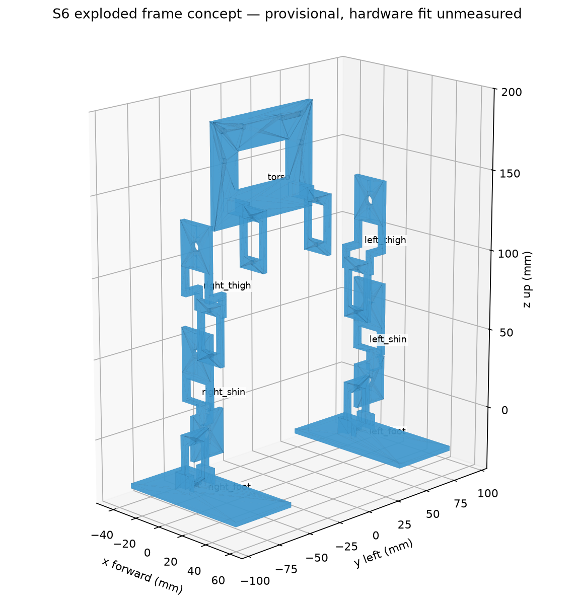

# School Biped S6 — hardware-first implementation handoff

Research checked 8 October 2026. Generated by `tools/build_handoff.py`; source files embedded below are the actual project files. **Status: runnable, locally tested simulation; provisional hardware design; procurement and manufacturing remain blocked.** Sourced claims, estimates, software results and unmeasured hardware are distinguished throughout.

## 1. Short design recommendation

Use six Waveshare 15024 MG90S servos in a small biped with **hip pitch, knee pitch and ankle roll on each leg**. Short 50 mm thighs/shins, broad 90 × 45 mm feet, laptop inference, Pico H, PCA9685 and an MPU6050 form a reasonable research baseline for slow stepping. Estimated assembled mass is **208.4 g**, with approximately **189 mm frame height** in the home pose. No arms or decorative head are required.

This is a prototype proposal, not a verified walking kit. The known delivered basket is **€90.32**, leaving **€9.68 for every unresolved item**. Finished prints, matched horns, fasteners and a suitably rated power connector are still unquoted/unconfirmed. The €100 constraint has **not** been met by a complete purchasable basket. Do not order the full robot or manufacture these interfaces yet. No component purchases or supplier messages were made.

The software can immediately run test training. Its provisional twin uses the proposed frame and exact selected product dimensions, plus explicitly estimated interfaces and dynamics. It is not a frozen twin of an assembled robot. A 10,240-step smoke run produced standing and approximately 1–2 mm of drift, **not walking**. The six-servo [Lynxmotion BRAT](https://wiki.lynxmotion.com/info/wiki/lynxmotion/view/ses-v1/ses-v1-robots/ses-v1-bipeds/brat/) is a mechanical precedent; it does not prove small-servo RL transfer.

## 2. Comparison of 6 DOF versus 8 DOF

| Design | Walking / stability | Cost, mass and power | RL / transfer / mechanics | Decision |
|---|---|---|---|---|
| A: each leg hip roll, hip pitch, knee pitch; 6 total | Lateral leg control, but both ankle axes fixed; foot orientation and landing constrained | Six servos €21, 73.2 g before frame; six unknown current loads | Few actions; fixed feet may require large lean and edge contact; easy frame, falls load hip gears | Compare only |
| B: A + ankle pitch; 8 total | Better sagittal foot alignment; no ankle roll; larger motion range | Servos €28, 97.6 g; **at least** €7 and 24.4 g extra plus brackets/wires/printing; assumed simultaneous peaks rise 4.8 → 6.4 A | More actions, failure points and calibration; extra freedom does not automatically help RL; proposed 5 A supply no longer covers the peak hypothesis | Upgrade requiring a new budget/power/frame design |
| Selected: hip pitch, knee pitch, ankle roll; 6 total | Direct lateral weight shift at the feet; broad soles help; coupled sagittal foot pitch limits step length | Six servos; same motor cost as A; short links reduce bending moments | Six controls and replaceable brackets; repeatable slow lean/lift/land sequence is plausible; no hip yaw or ankle pitch limits turning and uneven-ground performance | Baseline |

Eight joints cannot fit the present basket without further cost reductions: extra motors alone take the known subtotal to €97.32, before additional frame/power and the existing unknowns. Choose few joints to reduce calibration, wear and budget pressure. Neither configuration supplies true servo feedback or certified continuous torque. Stable walking remains an experiment.

## 3. Selected robot architecture

Joint order is **left hip, left knee, left ankle, right hip, right knee, right ankle**, everywhere. SI coordinates are **x forward, y left, z up**. Hips and knees rotate about local **+y**; ankle roll about **+x**. At zero angles, body axes match the parent. Positive pitch tips a downward link toward −x; positive ankle roll rotates the foot plane according to the right-hand rule. Physical right-hand servo mounting requires measured pulse signs; do not assume both legs share an electrical sign.

The torso contains the two hip servo housings, controller, PWM board and IMU. Each thigh carries its knee housing. Each shin carries no servo housing; each foot carries its ankle housing. This matches the proposed printed brackets and avoids double-counting actuator mass. Electronics are tied to the backplate with protected/insulated wiring; IMU mounting must be rigid. A short heavy power bus feeds servo branches separately from the logic.

The policy runs at **50 Hz** on the laptop. Pico processes the IMU at **200 Hz**, updates PCA pulse targets at 50 Hz and reports **post-limit command targets**, never measured shaft positions. MuJoCo runs at 500 Hz. A 200 Hz IMU on the 2 ms simulation grid alternates 4/6 ms intervals; the estimator uses the actual interval.

Actions are six normalized values in `[-1,1]`, mapped linearly to the JSON safe intervals. Home angles are `[-10,10,0,-10,10,0]°`; neutral action is therefore **not six zeros**. Each observation frame is estimated gravity direction (3), gyro divided by 10 rad/s (3), normalized applied command targets (6), previous requested actions (6). Five frames make **90 float32 observations**. The same complementary gravity filter uses raw accelerometer/gyro in simulation and the robot. Sensor axes/bias are calibrated before filtering; accelerometer blending is suppressed for large deviations from gravity. Translation, true attitude, true joint angles, velocity and contact are excluded from policy inputs. Five frames give roughly 80 ms of history; they cannot recover every unobserved servo error.

## 4. Servo comparison

These are product-specific claims, not interchangeable specifications for all similarly named servos. Prices include VAT; stock and variants must be checked at checkout. 1 kgf·cm = 0.09807 N·m.

| Exact product / source | Unit price / availability | Size; mass | Voltage; claimed stall torque | Claimed unloaded speed | Gear/control / assessment |
|---|---|---|---|---|---|
| [Waveshare 15286 SG90](https://www.welectron.com/Waveshare-15286-SG90-Servo_1) | €1.90; listing indicated about three months delivery | 22.8 × 12.2 × 28.5 mm; 10.5 g | 4.8–6 V; 2.0/2.2 kgf·cm | 0.09/0.08 s per 60° at 4.8/6 V | Plastic gears, position PWM; lower cost but gearbox/fall durability concerns; €9.60 saving for six does not establish the whole budget |
| **[Waveshare 15024 MG90S](https://www.welectron.com/Waveshare-15024-MG90S-Servo_1)** | **€3.50; shown in stock** | **22.8 × 12.2 × 28.5 mm; 12.2 g** | **4.8–6 V; 2.0/2.8 kgf·cm** | **0.11/0.09 s per 60° at 4.8/6 V** | Metal gears, position PWM; chosen for low price and replaceability, with selected-product dimensions |
| [MG90D at Rotorama](https://www.rotorama.de/product/mg90d) | €4.09; stock shown | 22.8 × 12.4 × 28.5 mm; 12 g | 4.8–6 V; 1.8/2.2 kgf·cm | Table says 0.10 and 0.08 s, both labelled 4.8 V; higher-voltage speed **unresolved** | Metal, digital position PWM; claimed 90° between 1000–2000 µs, horns included; not enough evidence of better repeatability to justify selecting it |
| [FEETECH FS90, Pololu data](https://www.pololu.com/product/2818/specs), [EU seller](https://eckstein-shop.de/feetech-fs90-1-5kg-analog-servo) | EU listing €3.55; availability/country messages ambiguous | 23.2 × 12.5 × 22 mm; 9 g | 4.8–6 V; 1.3/1.5 kgf·cm | 0.12/0.10 s per 60° | Plastic, analog PWM; 120° at 900–2100 µs, documented 3.3 V signals; weaker and different frame; **FS90R is continuous rotation and unsuitable** |

Selected listing also claims 180° travel and 5 µs deadband. Neither proves calibrated angular range, backlash or long-term repeatability. [Original TowerPro MG90S](https://towerpro.com.tw/product/mg90s-3/) has different mass/torque claims; those are not specifications for the Waveshare item. Very cheap servos can vary with load, voltage, temperature and wear. Metal gears do not guarantee low backlash. Expect per-servo calibration and replacements.

For all four, sustainable torque, lifetime and gear backlash are **unknown**. Current for the selected MG90S, SG90 and listed MG90D is **unknown**. Pololu measured approximately 600 mA stall and 200 mA no-load at 6 V for FS90, explicitly variable; its [manufacturer PDF](https://www.pololu.com/file/0J1435/FS90-specs.pdf) gives different current numbers. Do not transfer either current value to MG90S. No real torque/current measurements were performed.

Torque feasibility: `τ = m g d`. A 250 g mass at 20 mm offset requires `0.250 × 9.81 × 0.020 = 0.0491 N·m`; a rough 2× dynamic margin gives 0.0981 N·m. The selected seller's 4.8 V stall claim is 0.196 N·m. Stall torque is not a safe repeated-hold rating. The simulation starts with **0.08 N·m intermittent estimated force cap**; physical PWM servos have no programmable torque cap.

The actual 208.4 g proposed body distribution was evaluated by virtual work, holding the left foot fixed and allowing the right foot to be unloaded. Moments below are absolute magnitudes; this is a gravity calculation, not a loaded-servo test:

| Pose | Left hip | Left knee | Left ankle | 2× worst demand | Interpretation |
|---|---:|---:|---:|---:|---|
| Home, pretend single left support | 0.0013 | 0.0139 | 0.0695 N·m | 0.1390 N·m | COM is 34 mm to the side, outside 22.5 mm foot half-width; **not a feasible balanced single-support pose** |
| 15° lateral lean toward left | 0.0013 | 0.0134 | 0.0356 N·m | 0.0712 N·m | COM lateral offset 17.4 mm is inside the ideal support footprint; little measured margin yet |
| Lift right leg after leaning | 0.0039 | 0.0161 | 0.0337 N·m | 0.0675 N·m | Right knee gravity demand 0.0126 N·m; plausible slow-step starting pose |
| Deep stance bend, stress case | 0.0112 | 0.0494 | 0.0423 N·m | 0.0989 N·m | Exceeds provisional 0.08 N·m at 2× margin; do not treat every angle-limit pose as a safe loaded stance |

See [reproducible torque calculations](validation/torque_estimates.json) and `tools/torque_estimates.py`. Transfer weight before lifting; keep initial movements slow. Shock loads from falls are not covered by this static calculation.

## 5. Complete BOM with sourced prices and links

This is the complete **required-item register**, with unresolved costs explicitly retained. It is **not a complete purchasable basket**. Prices are checked listings, not saved checkout invoices. VAT and standard Germany shipping are included where priced. A free school helper is assumed for soldering/lead preparation; a paid charge must enter the budget. Laptop, measurement tools and ordinary screwdrivers are outside robot-part cost. No printer or battery is assumed.

{{BOM}}

Selection rationale and alternatives: Pico H avoids header soldering and unnecessary Wi-Fi; a bare Pico might save board cost but adds soldering and needs a fresh price check. PCA9685 gives a common 50 Hz pulse source; Pico has enough PWM channels to replace it, but that changes this baseline and the firmware. MPU6050 is an inexpensive useful attitude/gyro source; no camera, lidar, encoder or foot switch is required. An IMU is strongly recommended because a command-only controller cannot detect body tipping. The enclosed Mean Well PSU avoids exposed mains wiring; a generic cheaper adapter is not accepted without a credible voltage/current rating and compliance documentation. Pre-soldered IMU/PWM alternatives could reduce helper work, but their delivered prices have not been established. Wires, resistor, header, capacitor, ties and shrink sleeve provide the required harness/OE/mounting functions; borrowing spare workshop parts changes actual cost only when confirmed.

The selected PCA board package lists loose connectors, so helper assembly is included as work, not assumed already soldered. Servo branches use six extensions prepared by the helper for power injection; branch gauge/current capability must be checked. No rail rating is assumed for PCA traces. Horn/screw inclusion is **not verified** and remains a required pending item.

Optional items: one spare MG90S costs €3.50 before any extra delivery; a slack safety line, thin protective mat and longer USB/heavier power tether remain unpriced optional additions. A USB-C-only laptop requires an adapter, which would become required. The baseline PSU lead/USB cable are approximately 1 m: initial short steps are possible near the supply, but a few-metre travel setup needs a separately priced tether. No complex overhead rig is mandatory.

## 6. Total cost and budget gate

| Budget element | Cost |
|---|---:|
| Known required products | **€75.52** |
| Welectron + BerryBase + Funduino standard shipping | **€14.80** |
| Known delivered subtotal | **€90.32** |
| Finished printing/soles, matched horn hardware, fasteners, rated DC connection | **Unknown** |
| Complete delivered total | **Not established** |
| Remaining under €100 for every unknown | **€9.68** |

The €50–75 target is not achieved by this basket: known products alone exceed €75, before shipping and all pending items. There is **no verified cheapest viable delivered configuration** under €100. The recommended configuration above is conditional on a passing quote and fit gate. An explicitly revised direct-Pico-PWM design could remove the €6.50 PCA board, bringing this known subtotal to €83.82 if all other costs stayed equal; printing/hardware remain unknown, so this is not a purchasable alternative or a silent substitution. Weaker servos have not been selected to disguise a shortfall.

If pending delivered costs sum to `U`, complete cost is `90.32 + U`; actual shortfall is `max(0, U − 9.68)`. No numeric shortfall can be truthfully reported before the quote. `tools/budget_gate.py` treats unpriced parts as pending, never zero; it exits 2 for incomplete, 1 for over budget and 0 only for a fully cleared basket. See [current machine-readable gate](budget_status.json).

The [Meltlab price/quotation page](https://meltlab.de/preise) and [Printfaktur](https://printfaktur.de/) provide quote routes. An exact quote was not obtained: no browser/upload surface is available in this environment, and no supplier was contacted. [Ready-to-review quotation brief](../cad/QUOTE_REQUEST.md) and [quote bundle](../cad/quote_bundle.zip) include exact prototype files. A headline per-part printing price or an allowance is not a quotation. Resolve horn/ear fit before sending a manufacturing order. If the delivered quote breaks €100, stop procurement and revise explicitly.

## 7. Mechanical design and assembly

`physical_spec.json` is the authoritative physical ledger. `build_model.py` mirrors right-side components and computes aggregate mass/COM/full inertia, assigning each servo, frame, PCB, fastener allowance and wire allowance **exactly once**. Rigid-body inertias are solid CAD estimates for PETG frames and uniform-box estimates for other components, combined using the parallel-axis theorem. They are not measured inertias. The hanging tether is excluded; its disturbance must later be measured.

{{BODIES}}

Torso envelope is 40 × 82 × 66 mm. Each inter-joint leg segment is 50 mm. Feet are 90 × 45 × 3 mm PETG plus 1 mm TPU, local centre x = +6 mm, z = −22.5 mm for the plate and −24.5 mm for the sole. Ankle-to-floor distance is 25 mm when flat. Servo dimensions refer to the seller's overall case envelope; shaft, ears, spline, horn holes and lead exit are **unmeasured**. These unresolved features prevent manufacturing release.

{{COMPONENTS}}

Component dimensions are approximate envelopes, not every detailed printed surface. Frames use solid PETG density 1270 kg/m³, TPU estimate 1200 kg/m³. Actual infill and finished printing change mass. Fastener/wire masses are estimates; servo mass is a seller claim. Aggregate full inertias are:

{{INERTIA}}

Editable CAD is [cad/build_frame.py](../cad/build_frame.py), producing seven named frame STLs and two sole STLs in `cad/stl/`. All nine meshes are watertight and each frame is one connected solid. `quotation_plate.stl` is a convenience visualization of the seven frames; **do not order it in addition to those frames**. No external proprietary CAD program is needed to edit the Python dimensions. [Exploded view](../cad/exploded.png) shows assembly relationships. [Assembly instructions and fastener counts](../cad/ASSEMBLY.md) cover six joints and electronics mounting.



Prepared parts must arrive with usable holes and no cutting/drilling/tapping/heat-set inserts. Provisional quantities are 12 M2 × 8 ear screws, 12 nuts, 24 washers, 12 matched horn-to-frame screws/washers, six horn shaft screws and six horns. Exact horn screw thread and mounting lengths must be confirmed with the actual package. The service must include any sole bonding/finishing; its price is pending. Printed walls are nominally 3 mm; preferred PETG frame and compliant replaceable TPU soles. A finite mesh audit checked 55 poses for frame/frame and assigned-case/frame intersections; it does not certify horn fit, cable clearance, strength, all continuous poses or every neighboring component.

The full physical ledger is included here so copying the runnable sources also supplies their required JSON:

{{CODE:physical_spec.json}}

## 8. Wiring, power and hardware interface

{{TEXT:docs/HARDWARE.md}}

The helper needs a temperature-controlled soldering iron, solder, cutters/stripper and borrowed multimeter; these are tools and excluded from part cost. No equipment price was verified because helper use is assumed. The exact tasks are header/terminal assembly where supplied loose, sensor headers, OE pull-up adjustment if needed, and insulated direct power-injection harness joints. The student receives a ready-made harness and performs screw/plug assembly. Never bypass the power-connection rating gate just to avoid a small solder job.

## 9. MuJoCo and control parameter table

| Parameter | Starting value | Provenance / limitation |
|---|---|---|
| Total modeled mass | 0.208431 kg | Design ledger, not weighed hardware |
| Physics / integrator | 0.002 s; implicitfast | Numerical choice, locally compiled |
| Gravity | 0, 0, −9.81 m/s² | Indoor Earth approximation |
| Hip / knee / ankle limits | [−35,35] / [−10,60] / [−20,20]° | Software-safe hypotheses, calibrate actual range |
| Position kp / velocity kv | 0.9 N·m/rad / 0.012 N·m·s/rad | Estimated internal-servo response |
| Peak simulated actuator force | ±0.08 N·m | Estimated intermittent envelope; physical servo cannot enforce this setting |
| Torque-speed envelope | Available drive torque falls linearly toward seller unloaded speed | Simple DC-like estimate; braking torque retained, backdrive not hard speed clipped |
| Unloaded shaft speed reference | 60° / 0.11 s = 545°/s at 4.8 V | Selected seller claim, measure at actual 5 V/load |
| Command slew | 180°/s, at most 3.6° per 20 ms update | Target trajectory limit; **not a measured shaft-speed limit** |
| Command delay | 20 ms nominal; 20–40 ms DR | Estimate; delayed commands applied on 50 Hz ticks |
| Target deadband | 0.5° | Command hysteresis surrogate; not true gear backlash |
| Joint damping / friction loss / armature | 0.002 N·m·s/rad / 0.001 N·m / 5e−6 kg·m² | Estimated passive gearbox properties |
| Contact friction | 0.8 sliding, 0.005 torsional, 0.0001 rolling | Ground/TPU contact estimates; MuJoCo torsional/rolling coefficients have different units from sliding |
| Foot contact | Flat plate plus 1 mm sole box | Simple primitive, whole-foot clearance used for evaluation |
| Gyro / acceleration noise | 0.006 rad/s / 0.04 m/s² standard deviation | Conservative hypotheses, not measured MPU6050 noise |
| Gravity filter | 0.5 s blending time; 0.8–1.2 g acceptance window | Shared preprocessing choice, sensitive to sustained acceleration |

Position actuators implement bounded `kp(target − angle) − kv velocity`. The environment adds command queue latency, post-delay target slew, hysteresis and a direction-dependent torque-speed envelope. Joint motion remains dynamic. True actuator force limits exist in simulation only; hobby PWM hardware has no current/torque telemetry or programmable torque protection. Software angle/rate limits reduce risk but cannot prevent damage during stalls/falls. Model choice follows the [MuJoCo XML actuator reference](https://mujoco.readthedocs.io/en/latest/XMLreference.html).

Reward each 20 ms step is `dt × [10 clip(vx, −0.05, 0.06) + 0.2 upright − 0.5 abs(vy) − 0.0001 mean(action_rate²)]`, minus 2 on a fall. Capped forward progress discourages explosive speed; upright rewards standing; lateral motion discourages drift; command-rate penalty discourages abrupt actions. This is a **smoothness proxy, not measured electrical energy**. Ground-truth simulation motion is permitted for rewards/metrics, never policy observations. The simple reward admits standing as a local optimum; observed smoke results demonstrate that limitation.

Fall means root height below 60% of home height, tilt beyond 60°, or non-foot floor contact. A fall terminates; 30 s without a fall truncates. Training reset has a 0.2 s settling period excluded from reported episode duration. Physical reset is manual. Evaluation counts a lifted step only after landing, following **at least 40 ms continuous whole-foot clearance ≥3 mm with opposite-foot contact**. Alternating qualifying landings are counted separately. Success requires ≥0.3 m travel, no fall, at least two qualifying steps on each side and three alternations within 30 s. Sliding, toe pivots and hops without opposite-foot support do not meet this metric.

## 10. Full `robot.xml`

Save this as `robot.xml` beside the Python files and supplied `cad/stl/` directory. Meshes are visual only; primitive geometry handles contact. `build_model.py` regenerates XML from the ledger.

{{CODE:robot.xml}}

## 11. Full `humanoid_env.py`

Gymnasium termination/truncation, seedable resets, conservative domain randomization, shared IMU observations, servo approximation and rendering are implemented here. [SB3 custom-environment guidance](https://stable-baselines3.readthedocs.io/en/master/guide/custom_env.html) informed the interface; the installed version's checker was executed.

{{CODE:humanoid_env.py}}

The following shared files are **required** beside it. Their full contents are included to avoid an incomplete copy-and-paste environment.

`robot_config.py`:

{{CODE:robot_config.py}}

`servo_control.py`:

{{CODE:servo_control.py}}

`imu_observation.py`:

{{CODE:imu_observation.py}}

`hardware_interface.py` supplies protocol arithmetic and parsing helpers. It is not deployed firmware or an automatically arming hardware runner:

{{CODE:hardware_interface.py}}

## 12. Full `train.py`

{{CODE:train.py}}

## 13. Full `evaluate.py`

{{CODE:evaluate.py}}

## 14. `requirements.txt`

Pinned releases below were installed together and tested on Linux with Python 3.12, including CPU PyTorch. No CUDA is needed. This is a tested top-level dependency set, not a transitive lockfile.

{{CODE:requirements.txt}}

For development/CAD/regression checks, also use:

{{CODE:requirements-dev.txt}}

## 15. Instructions to run simulation and training

Use the supplied project folder or archive, including `physical_spec.json`, all shared Python files and CAD meshes. Linux commands from the project root:

```bash
python3.12 -m venv .venv
source .venv/bin/activate
python -m pip install --upgrade pip
python -m pip install -r requirements.txt
python evaluate.py --episodes 1 --output runs/neutral
python train.py --steps 2048 --seed 0 --output runs/smoke
python evaluate.py --model runs/smoke/final_model.zip --episodes 5 --seed 1000 --output runs/smoke_nominal
python train.py --steps 1000000 --seed 0 --output runs/nominal
python train.py --resume runs/nominal/final_model.zip --steps 1000000 --seed 0 --randomize --output runs/randomized
tensorboard --logdir runs
```

PPO rolls out in blocks of 1024, so requested steps round up to a rollout boundary. One million steps is a starting experiment budget, not a walking guarantee. A separate nominal evaluation environment selects best checkpoints; evaluate robustness separately, since mean reward alone does not establish walking.

```bash
python evaluate.py --model runs/randomized/final_model.zip --episodes 10 --seed 1000 --output runs/eval_nominal
python evaluate.py --model runs/randomized/final_model.zip --episodes 10 --seed 1000 --randomize --output runs/eval_randomized
MUJOCO_GL=egl python evaluate.py --model docs/validation/smoke_checkpoint.zip --episodes 1 --seed 1000 --video --output runs/reproduce_video
python evaluate.py --model docs/validation/smoke_checkpoint.zip --episodes 1 --render
```

`--video` saves `episode_0.mp4`, showing only the first episode. `--render` opens the passive MuJoCo viewer; a local desktop is required. Physics/training without rendering needs no display. EGL rendering worked here; on a machine without EGL use `MUJOCO_GL=osmesa` after installing its system runtime, or use the desktop viewer. Missing system OpenGL libraries are an installation issue, not policy failure. TensorBoard provides its local URL when started.

Rebuild prototype artifacts/checks only when changing the design:

```bash
python -m pip install -r requirements-dev.txt
python cad/build_frame.py
python tools/sync_frame_mass.py
python build_model.py
python tools/check_clearance.py
python tools/torque_estimates.py
python tools/budget_gate.py
python -m pytest -q
python tools/build_handoff.py
```

Budget command currently **exits 2 intentionally** for incomplete procurement. Do not chain it with `&&` and expect later commands to run. `sync_frame_mass.py` is for prototype solid-CAD estimates only and must not overwrite later measured masses. After hardware measurement, edit the ledger directly and run `build_model.py`. Keep training files/JSON/hash records together; do not use an old policy after changing joint/action/observation conventions.

## 16. Calibration procedure for the real robot

{{TEXT:docs/CALIBRATION.md}}

## 17. Sim-to-Real and domain-randomization plan

All ranges live in `robot_config.py`'s `Randomization` dataclass. Randomization is off by default and opt-in through `--randomize`. Before each reset, the environment restores nominal mass, inertia, friction, damping and force ranges; each mass multiplier also multiplies that body's inertia. Servo strength/speed, offsets, delay, sensor bias and noise reset from their nominal assumptions rather than drifting cumulatively.

| Parameter | Initial range | Interpretation |
|---|---|---|
| Body and limb mass / matching inertia | ±5% per rigid body | Conservative assembly estimate |
| Contact friction | ±15% | Same intended surface/sole, not arbitrary terrain |
| Servo strength | ±15% | Around estimated 0.08 N·m cap |
| Unloaded speed and commanded slew | ±10% | Shared starting multiplier; measure separately later |
| Joint damping | ±20% | Estimated gearbox resistance |
| Servo joint offsets | ±1° per joint | Residual angular calibration error, applied after reported target |
| Command delay | 20–40 ms | Target queue hypothesis; applies at 50 Hz ticks, hence most draws quantize to 40 ms |
| Gyro residual bias | ±0.01 rad/s per axis | Episode-constant after calibration |
| Accel residual bias | ±0.05 m/s² per axis | Episode-constant after calibration |
| White noise | gyro 0.006 rad/s; accel 0.04 m/s²; scale 0.8–1.2 | Independent sample noise; hypotheses |

Do not broaden ranges to hide a mismatched model. First fit nominal mechanics, IMU and loaded servo step responses. Establish standing and visibly lifted steps in nominal simulation, then fine-tune with measured variations. Evaluate both conditions on fixed seeds (1000–1009 suggested) and several training seeds. Reject policies with drift/sliding even if reward rises. Observe body tipping and commands on the robot; log IMU/targets/timestamps and compare against simulation under the same control preprocessing. Measure shaft motion externally with video because MG90S gives no encoder output.

First real trials use a low clear floor, broad soles, thin protective surface, short slack tether and an optional slack safety line. A table edge is an unnecessary fall hazard. Begin with a calibrated manual stand and lean/lift/land test before policy deployment. Armed hardware inference requires the MCU handlers and PC serial runner specified above, which are intentionally pseudocode at this stage. A trained policy must never be the first test of watchdogs, safe angles or power cutoff.

## 18. Remaining unknowns and risks

The complete delivered price and exact over-budget shortfall are unknown until quoted. The unresolved €9.68 envelope is very tight; printing and matching fasteners may make the baseline infeasible. The model is therefore provisional. Horn/ear/shaft dimensions, included accessories and frame strength are unverified. No printed fit prototype or real robot exists from this implementation.

Servo current, continuous torque, loaded repeatability, backlash, thermal lifetime and 3.3 V signal compatibility remain unmeasured. The 5 A PSU selection depends on a current hypothesis, not a six-servo measurement. A rated power connector and branch validation are required. PCA output-disable boot behavior and actual board pull-ups must be checked. Reconnect servo power only while disarmed. The real servos provide no torque control or actual position feedback; simulated command targets are not shaft measurements. Saturated servos can silently lag until IMU motion reveals a problem.

The twin approximates gears, collisions, wires and PCB inertia. True backlash, PWM pulse quantization, supply droop, flex, floor compliance, wear and tether forces are not fully modeled. The finite CAD checks do not certify every continuous pose or loaded structural response. A soft training surface changes contact physics and must be calibrated. Large feet encourage sliding, which is why foot clearance/support metrics are separate from reward.

The local tests establish software execution, mass accounting and finite dynamics. They do **not** establish real walking or robust policy transfer. The 10k-step policy stood for 30 seconds in ten evaluated simulation episodes and exhibited no qualifying steps. The 0.3 m alternating-walk target was **not achieved**. No physical test, quote, purchase or deployed firmware is claimed. Standing can be a reward local optimum; subsequent training/reward experiments should be reported with foot metrics, including failures.

## 19. Exact recommended build and test order

1. **Resolve procurement first:** confirm selected-servo package dimensions/horns, obtain a delivered print/sole/fastener quote and a rated connector source, verify checkout shipping and all fees. Run the budget gate. Stop procurement if total exceeds €100; record the actual shortfall. Ordering staged parts can add shipping: include that in the total before any purchase.
2. Have the helper prepare headers, OE pull-up and the insulated short power harness. Bench-test the commercial PSU connection, Pico USB, IMU and one servo. Keep servo power out of Pico/PCA distribution traces. Test physically disconnecting servo power.
3. Measure that servo's safe range, signs, offsets, hysteresis, unloaded/loaded speed, latency, current and brief usable torque. Avoid prolonged stalls. Confirm 3.3 V pulse operation and all current-carrying connector ratings.
4. Measure housing/ear/shaft/horn holes and lead exit. Update CAD, check one finished interface, then obtain/reconfirm the full-frame delivered quote. Order all prints only when fit and budget are cleared.
5. Assemble and weigh individual rigid components, one leg, then the complete robot. Install hip/knee housings and foot-mounted ankle housings exactly as the ledger specifies. Center horns at calibrated zero before commanding home. Replace estimates with measured masses/COM/offsets.
6. Validate both legs' directions, conservative safe poses, power cutoff, disarmed startup, explicit arming, STOP, watchdog and strain relief. Check wires through slow motions. Manual reset after every fall.
7. Update the physical ledger, safe limits and servo/IMU calibration. Regenerate MJCF. Version the measured configuration; preserve old experiment records. Recheck clearances, standing contacts and supported-pose torques.
8. Run the checker/tests and PPO smoke training; reload the checkpoint, evaluate fixed seeds and save video. Confirm observations contain only deployable quantities.
9. Train nominal policies until standing and qualifying alternating steps are observed, then fine-tune randomized policies. Evaluate nominal/randomized conditions separately; use foot metrics and video, not reward alone.
10. Implement and test the bounded MCU/PC protocol without automatic arming. Test a known manual stand, then deploy a policy for standing and progressively longer low-speed steps on a low clear surface with slack cables. Keep the physical disconnect reachable; use optional slack line.
11. Compare simulation/hardware distances, durations, tipping, steps, failures, servo lag and cable effects. Recalibrate or redesign when evidence requires it. Present achieved results, including a failed transfer, rather than promising PPO success.

Local verification completed before this handoff:

| Check | Executed result |
|---|---|
| Model / mass / joint directions / standing contacts | Compiled; 6 hinges/6 actuators; mass ledger 208.4 g, servos assigned once; tests pass |
| CAD | 7 connected watertight frames + 2 soles; 55 finite sampled poses have no checked frame/frame or assigned-case/frame overlap |
| Neutral, bounded random, limit commands | Finite simulations; neutral stands for 30 s; fall/time-limit semantics verified |
| Interface / reproducibility | Seed reproducibility, DR nominal restoration, delay/slew, unavailable-feedback exclusion, CRC/bounds and whole-foot support checks pass |
| PPO/checkpoint | 10,240 training steps; 10,000-step checkpoint saved, reloaded; resumed 1,024-step training checked separately |
| Nominal seeds 1000–1004 | 30 s each; 0/5 falls; mean distance ≈0.001524 m; mean speed ≈0.00005081 m/s; mean reward ≈6.00596; 0 steps/0 success |
| Randomized seeds 1000–1004 | 30 s each; 0/5 falls; mean distance ≈0.001936 m; mean speed ≈0.00006453 m/s; mean reward ≈6.00868; 0 steps/0 success |
| Visualization | 30 s, 640 × 480, 50 fps MuJoCo MP4 saved and inspected |
| Hardware / delivered budget | **Not verified; procurement remains blocked** |

See [verification record](VALIDATION.md), [nominal per-episode CSV](validation/nominal/episodes.csv), [randomized CSV](validation/randomized/episodes.csv), [saved video](validation/nominal.mp4), [preview](validation/model_preview.png) and [reloadable smoke checkpoint](validation/smoke_checkpoint.zip). The project success target remains **30 s standing followed by ≥0.3 m visibly alternating walking within 30 s**. Only the simulation standing part has been demonstrated.
