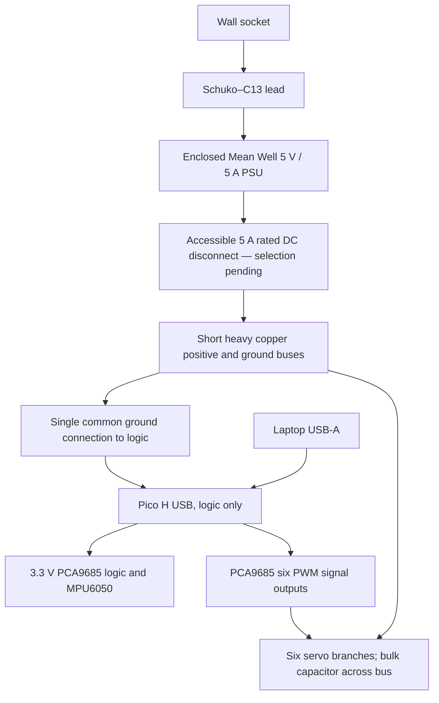

# Hardware interface and power — provisional, no tested firmware

The baseline is six Waveshare 15024 MG90S servos, Pico H, BerryBase 157066 PCA9685, Funduino MPU6050 module, and Mean Well GST40A05-P1J. Do not energize a complete robot until the connector, harness, servo current and fit gates in `procurement.json` pass. No purchases or hardware tests were performed.

## Power circuit



**Servo supply current bypasses the Pico, Dupont jumpers, breadboards, and the unverified PCA9685 power traces.** The selected PCA board generates pulses; it does not drive the motors electrically. Its chip's output-current specification concerns signals, not the servo V+ rail. [NXP datasheet](https://www.nxp.com/docs/en/data-sheet/PCA9685.pdf)

A helper prepares six 10 cm JR extensions as a power-injection harness. Keep the signal conductor connected between the male PCA-end connector and the female servo connector. Disconnect the power and return conductors from the PCA-end connector and join their **servo-side** ends to the positive and negative buses. Insulate all cut stubs and joints. Each servo still plugs into a replaceable extension. Add a short logic ground connection at the bus entry. Leave PCA V+ and its motor-power terminal unused. Verify continuity and connector polarity before any servo is attached. This wire preparation is part of the accepted helper job; the student assembles finished parts. The extensions' wire gauge and branch current rating remain unverified.

Use 0.75 mm² copper for buses no longer than 0.10 m each way. Resistance estimate at room temperature is `0.0175 × 0.20 / 0.75 = 0.0047 Ω`; 4.8 A would drop about 0.022 V there, **excluding PSU lead, connectors and individual servo leads**. A 2 m one-way tether of the same wire would drop about 0.45 V at 4.8 A and is unsuitable for a nominal 5 V rail. For the first 0.3 m trials use the PSU's existing lead, place the PSU near the floor test area, and route a slack loop with strain relief close to the torso COM. Several metres require a separately sourced thicker low-resistance cable and longer USB lead; these are not included in the certified-price subtotal.

Current assumptions, **not MG90S measurements**:

| State | Per servo hypothesis | Six-servo total |
|---|---:|---:|
| Loaded standing / slow movement average | 0.10–0.25 A | 0.6–1.5 A |
| Brief acceleration / near stall | 0.8 A | 4.8 A |

Pico, IMU and PWM logic draw from laptop USB, provisionally below 0.15 A combined. A 5 A PSU has only 0.2 A margin against the assumed six-servo peak. The selected servo has **no reliable product-specific current specification**: if measured transients exceed capacity, voltage drops below 4.8 V, or a connector becomes warm, stop and revise the budget/power design. A capacitor does not fix an undersized PSU. At 4.8 A, 1000 µF sustains only roughly 0.04 ms for a 0.2 V drop. It helps short transients, not sustained stalls.

Check loaded voltage at the farthest servo, including the factory PSU lead. The acceptable measured operating range is 4.8–6.0 V; do not assume a nominal 5 V label guarantees 4.8 V at every motor. Keep mains wiring entirely inside commercial leads and the enclosed PSU. [Selected PSU](https://www.berrybase.de/meanwell-schaltnetzteil-5v-dc-5-0a-mit-hohlstecker-5-5x2-1mm)

The required physical cutoff is an accessible **DC unplug connection rated for the full expected current**, near the operator. Its sourcing is still open. Disconnect it to remove servo power; the small downstream capacitor discharges briefly. A mains switch is a useful backup but has PSU hold-up delay. Disabling PWM or sending STOP cannot guarantee an analogue servo releases its last position, and is never equivalent to disconnecting power. Disarm before reconnecting servo power. No rail-voltage or per-servo current measurement is built in.

The €0.50 Goobay 76743 screw adaptor is a researched candidate with an **unknown current rating**, not a verified 5 A solution. The €1.80 BerryBase DCKSW cable is unavailable and also lacks a confirmed suitable DC rating. Neither is accepted to close the basket. [Adaptor](https://www.berrybase.de/dc-kupplung-fuer-hohlstecker-5-5x2-1mm-schraubmontage-terminal-block-2-pin), [switch cable](https://www.berrybase.de/dc-kabel-mit-schalter-5-5x2-1mm-stecker-5-5x2-1mm-buchse-35cm)

## Logic wiring

| Pico signal / physical pin | Connection |
|---|---|
| 3V3 OUT / 36 | PCA VCC and IMU VCC, both 3.3 V logic |
| GND / 38 | PCA GND, IMU GND and short connection to servo return bus |
| GP4 / 6 | I2C0 SDA, both boards |
| GP5 / 7 | I2C0 SCL, both boards |
| GP6 / 9 | PCA OE, 10 kΩ pull-up to 3.3 V |
| USB Micro B | USB data and Pico power |

The Pico never connects servo 5 V to VBUS, VSYS or 3V3. Use one short I2C bus at 400 kHz, PCA default address 0x40, IMU address 0x68 with AD0 grounded; scan first. Verify both modules' pull-ups go to **3.3 V**, not servo 5 V. Set MPU6050 ±16 g, ±2000°/s, approximately 44 Hz digital filtering and 200 Hz sample rate. Rotate the measured sensor axes into torso x-forward/y-left/z-up coordinates before passing samples to the shared estimator. [Pico pinout](https://datasheets.raspberrypi.com/pico/Pico-R3-A4-Pinout.pdf), [MPU6050 registers](https://invensense.tdk.com/wp-content/uploads/2015/02/MPU-6000-Register-Map1.pdf)

PCA channels 0–5: left hip, left knee, left ankle, right hip, right knee, right ankle. Set actual PWM frame frequency to 50 Hz and calibrate its oscillator; nominal PWM resolution is about 4.88 µs per tick. Configure OE-high outputs LOW. The board may have an onboard OE pull-down: remove/change it if necessary so the external pull-up actually disables outputs during Pico reset. Verify the power-up waveform before attaching horns. The selected servo's 3.3 V signal threshold is unknown and must pass a one-servo bench test. Do not assume every MG90S-labelled servo has identical electronics.

Helper soldering: any loose IMU/PCA headers, six signal output pins if not fitted, OE pull-up, capacitor and power-injection harness. A temperature-controlled iron, flux-core solder, cutters/stripper, heat-shrink and multimeter suffice. Borrow the school's equipment if possible; tools are excluded from the component budget. Solder/heat preparation happens away from attached servos and USB. No frame drilling, sawing, tapping or heat-set inserts are planned.

## Version 1 serial protocol

USB CDC, nominal serial baud 460800, ASCII newline packets, at most **192 bytes including newline**. No dynamically growing input buffer. Payload ends in `*HHHH\n`, CRC-16/CCITT with initial 0xFFFF (Python `binascii.crc_hqx`). SI units in Python; integer milliradians, millimetres/s² and milliradians/s on the wire. Use monotonic local timestamps modulo 2³² ms. USB baud is a descriptor setting, not the native CDC throughput limit.

| Payload before checksum | Purpose |
|---|---|
| `H,1,seq,pc_ms` | Hello/configuration query |
| `I,1,seq,mcu_ms,digest,cal_valid` | Hello response: lowercase 64-character SHA-256 digest and calibration validity 0/1 |
| `A,1,seq,pc_ms,1` | Explicit arm request |
| `A,1,seq,pc_ms,0` | Disarm request, always permitted |
| `C,1,seq,pc_ms,q0,q1,q2,q3,q4,q5` | Six validated target angles |
| `S,1,seq,pc_ms` | Stop: disable PWM and latch stop fault |
| `R,1,seq,pc_ms` | Clear faults only while disarmed and after their causes have been corrected; does not arm |
| `T,1,ack_seq,mcu_ms,status,q0,...,q5,ax,ay,az,gx,gy,gz` | Applied-target acknowledgement plus raw IMU sample, 200 Hz |

Status bit mask: 1 armed; 2 watchdog fault; 4 invalid command; 8 sensor/configuration fault; 16 stopped. Any fault is latched and disarms; rearming requires explicit fault clear after cause correction and a new handshake. Header sequence is uint16, time uint32; reject duplicates, stale packets and backward sequences with modulo comparison (`0 < delta < 32768`). More than 100 ms since a **valid fresh C command** disables PWM. Hello and telemetry do not refresh the command watchdog. PC monitors missing telemetry with its own 100 ms deadline. Neither clock is presumed synchronized. Use relative deltas and record receive times; handshake measures offset/round-trip latency.

Use one increasing PC sequence counter for all control packets. Only perform a new H handshake while disarmed. At H receipt, MCU records `pc_to_mcu_offset = mcu_receive_ms - pc_ms` modulo 2³². Convert later C timestamps with that offset, using signed wrap-safe differences; reject commands with inferred age above 80 ms or more than 20 ms in the future. PC checks handshake round-trip time is below 20 ms before requesting ARM. These provisional timing tolerances require bench measurement. A packet with a new sequence but old timestamp must not refresh the watchdog. Telemetry repeats the latest **applied C sequence**, so the PC permits repeated acknowledgements while independently requiring advancing MCU sample timestamps and rejecting duplicate/backward IMU samples.

`hardware_interface.py` implements bounded command encoding, CRC validation, telemetry parsing and per-servo calibrated pulse mapping. Command endpoints round inward to avoid quantized unsafe angles. `H/I/A/S/R` are protocol specifications, not implemented MCU handlers in this delivery. Digest is SHA-256 of the exact shared calibration/configuration file bytes agreed by PC and MCU; this file must include joint order, signs, angle limits, zero pulses, pulse gains, slew limit and IMU rotation/bias. Do not use the simulation-only XML hash as the hardware configuration digest. A receiver must validate exact packet kind, field count, integer range, CRC and version before any state change. Flush overlong input until newline, latch error, and keep outputs disabled. Never accept Python pickles, executable text, or unbounded JSON.

Applied targets describe the **post-validation, post-delay, post-rate-limiter commands** written to PWM. They are not measured shaft angles. Telemetry repeats the latest applied targets between 50 Hz updates. Do not label acknowledged angles “joint feedback.” Calibrate each channel's centre pulse, sign, µs/radian gain and safe pulse endpoints; there is no universal safe 500–2500 µs mapping.

## MCU and PC pseudocode

```text
BOOT:
  OE = HIGH; PWM outputs LOW; state = DISARMED
  load measured calibration; refuse ARM if absent or corrupt
  configure I2C, PCA 50 Hz, IMU 200 Hz; verify communication
  set applied targets to HOME but do not enable PWM

MAIN LOOP (nonblocking; hardware monotonic clock):
  parse bounded frames and CRC
  STOP/DISARM => OE HIGH; clear target queue; latch state as appropriate
  fresh valid COMMAND => check bounds; enqueue target; update watchdog
  ARM => only after explicit handshake, fresh HOME command, valid IMU,
         matching policy/configuration digest and cleared faults
  if armed and now - last_valid_command >= 100 ms:
      OE HIGH; state = WATCHDOG_FAULT; clear queue
  every 5 ms:
      read IMU; remove measured stationary biases; rotate into torso axes
      send timestamped T packet, applied targets, latest applied sequence, status
      sensor read failure/invalid sample => OE HIGH; latch fault
  every 20 ms if armed:
      accept pending command; apply measured command-delivery scheduling
      apply calibrated deadband and rate limit (initially <=3.6 degrees/tick)
      bound angles; map calibrated pulses; quantize to measured PCA ticks
      write six channels together; update applied targets/ack sequence

PC (initially hardware disconnected; no automatic ARM):
  load policy and matching physical/control/calibration configuration
  handshake, check version/order/calibration, initialize filter from rest IMU
  at each timestamped IMU sample:
      GravityEstimator.update(gyro, accel, measured_dt)
      check gyro/accel saturation, faults and freshness
  every 20 ms:
      frame = gravity(3), gyro/10(3), latest applied targets normalized(6),
              previous requested policy action(6)
      append to the same five-frame ObservationHistory
      policy predicts action; use action_to_target; send C frame
      remember requested action
  operator explicitly arms for a limited supervised trial
  fault, tilt >60 degrees, missing telemetry or Ctrl-C => send STOP;
      operator disconnects DC power and manually resets the robot
```

Initialize history with five copies of the measured resting frame, as in simulation. The simulator's initial 0.2 s settling interval does not replace a real startup check. Nominal command delay is a **provisional total PC-command to acknowledged-PWM delay** of 20 ms; at 50 Hz the random 20–40 ms delay often rounds to the next 40 ms tick. Do not add another guessed delay to the MCU until timings are measured. Servo shaft lag is represented separately by finite position-control dynamics. Timestamp comparisons need wrap handling and missed-tick rejection. This pseudocode requires implementation and electrical testing before hardware deployment.

Protect the USB lead and heavy power lead with a slack loop. Keep connector mass supported externally where possible. Cable force is not simulated, so record routing and direction in every physical trial. Never reset an RL episode by commanding an uncontrolled fallen robot back to HOME. Cut power, pick it up, inspect gears/brackets, then reinitialize.
